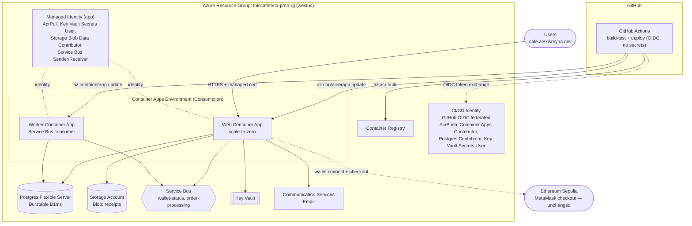

# ArtisanalBrew

ASP.NET reconstruction of the original coffee storefront, prepared as a clean .NET 10 solution with Blazor, ASP.NET Identity, PostgreSQL, Entity Framework Core, Docker, and a fully containerized Azure deployment (Container Apps, Postgres Flexible Server, Blob Storage, Service Bus, Key Vault, Communication Services Email).

## Live Demo

**[cafe.alexisreyna.dev](https://cafe.alexisreyna.dev)** — click through to see it running live on Azure Container Apps.

## Tech Stack

- .NET 10 LTS and ASP.NET Core
- Blazor Web App with interactive server rendering
- Clean Architecture: Web, Application, Domain, Infrastructure, Worker
- Entity Framework Core with PostgreSQL
- ASP.NET Core Identity
- Serilog
- xUnit, FluentAssertions, Moq, WebApplicationFactory, Testcontainers
- Deployed on Azure Container Apps, backed by Azure Blob Storage, Service Bus, Key Vault, and Communication Services Email

## Architecture

- `src/ThisCafeteria.Domain`: entities and enums.
- `src/ThisCafeteria.Application`: DTOs, validation, service interfaces, application services, repository contracts.
- `src/ThisCafeteria.Infrastructure`: EF Core DbContext, entity configurations, repositories, seed data, Identity user, Azure-backed storage/messaging/email services.
- `src/ThisCafeteria.Web`: Blazor pages, API controllers, Identity, Swagger, health checks.
- `src/ThisCafeteria.Worker`: background service that consumes order-processing messages from Azure Service Bus.
- `tests`: unit and integration test projects.

This project is the ASP.NET evolution of the original first version and idea: [AlejoReyna/thisCafeteriaDoesntExist](https://github.com/AlejoReyna/thisCafeteriaDoesntExist). The legacy Next.js app remains untouched at `/Users/alexis/TCDE/thisCafeteriaDoesntExist`.

## Run Locally

Postgres is published on host port **5433** (container 5432) so it does not conflict with a local PostgreSQL install on 5432.

```bash
cd /Users/alexis/TCDE/ThisCafeteria
cp .env.example .env
# Edita .env y reemplaza todos los valores CHANGE_ME / YOUR_DB_*
docker compose up -d postgres
dotnet restore
dotnet run --project src/ThisCafeteria.Web
```

Swagger is available in Development at `/swagger`, and health checks are exposed at `/health`.

The app requires `ConnectionStrings__DefaultConnection` from environment variables (`.env` for local development). No default password is embedded in source code.

## Migrations

```bash
dotnet tool install --global dotnet-ef
dotnet ef migrations add InitialCreate --project src/ThisCafeteria.Infrastructure --startup-project src/ThisCafeteria.Web
dotnet ef database update --project src/ThisCafeteria.Infrastructure --startup-project src/ThisCafeteria.Web
```

Admin user seeding reads:

- `Authentication:AdminEmail`
- `Authentication:AdminPassword`

## Tests

```bash
dotnet restore
dotnet build --configuration Release
dotnet test --configuration Release
```

## Worker

```bash
dotnet run --project src/ThisCafeteria.Worker
```

The worker connects to Azure Service Bus and processes messages from the `order-processing` queue via a real `ServiceBusProcessor`.

## Azure Infrastructure

Everything below is provisioned as Bicep IaC in `infra/` and deployed to Azure Container Apps (Consumption plan). Full audit, decisions, and phase-by-phase history live in [`docs/azure-migration-plan.md`](docs/azure-migration-plan.md).



**Status:** Phases 1–6 (containerize, IaC, real Azure service implementations, CI/CD via OIDC, data migration, DNS cutover) are complete and live. The old EC2/RDS/SQS/S3/SES footprint is fully out of the traffic path and its artifacts have been retired from `main` — see [`docs/aws-legacy-infra.md`](docs/aws-legacy-infra.md) for what it was and the [`aws_legacy`](https://github.com/AlejoReyna/ArtisanalBrew/tree/aws_legacy) branch for the preserved pre-migration snapshot.
