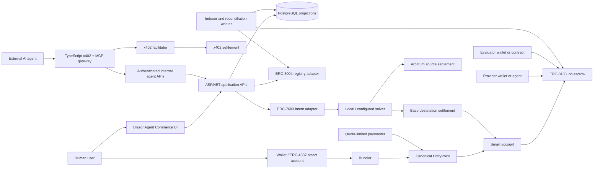

# Agentic Commerce Stack Orchestration Plan

Date: 2026-07-18
Status: implementation-ready design, dependent on the multichain foundation
Standards: x402 v2, ERC-4337, ERC-8004, ERC-8183, ERC-7683

## Session handoff (2026-07-24, later) — receipt-endpoint root cause found and fixed in app code, read this first

**Root cause of the `-32603 internal error: rpc provider error` receipt failure — confirmed with
evidence, not hypothesized.** Read-only diagnostics were run against the self-hosted node/bundler
(`thiscafeteria-sepolia-aa`, `thiscafeteria-prod-rg`) via the Azure guest agent (no SSH, no secrets
printed, no service mutated):

- The VM is healthy: Geth reports `eth_syncing: false` at block `0xad0ce4`; Rundler advertises the
  correct EntryPoint `0xdD9A61064eF9E2d9612dA1f1307E168B85fE43A6`. Geth is bound to `127.0.0.1:8545`
  (via docker-proxy) and was not exposed.
- Reproduced the failure read-only: Rundler `eth_getUserOperationReceipt` for the public hash still
  returns `-32603 internal error: rpc provider error`.
- **Isolated it to an unbounded log scan.** A direct node `eth_getLogs` for the EntryPoint's
  `UserOperationEvent` over the **full range `0x0..latest`** returns Geth's own
  `-32002 request timed out` — that is precisely the upstream error Rundler re-wraps as its generic
  `-32603 ... rpc provider error`. The **same query bounded** to the mined block (`0xad0cae` =
  11340974), or to a recent window (`latest-2000..latest`), returns the exact `UserOperationEvent`
  immediately: topics `userOpHash 0x87d8…c5c0`, sender `0x8bfc…c00c` (the salt-1 account), paymaster
  `0x3540…619f`. The mined transaction receipt is present on the node too.
- **Why Rundler scans the whole chain:** its process was launched with only `--chain_spec
  --node_http --rpc.port` and no `user_operation_event_block_distance`, so its receipt lookup
  defaults to searching from genesis — intractable for a full Sepolia node.

So the node is fine; the receipt endpoint breaks because Rundler asks Geth for an unbounded getLogs.
**Operator remediation (not applied here — restarting the live bundler is a service mutation that
also needs its signer secret, which is out of scope without explicit authorization):** relaunch
Rundler with a bounded `--user_operation_event_block_distance` (e.g. `10000`) so its receipt lookup
scans only a recent window. This was verified indirectly — bounded getLogs works; unbounded does
not.

**Application fix (done, and the durable one): confirmation no longer depends on the bundler's
receipt endpoint at all.** The previous `UserOperationSubmitter` polled
`GetUserOperationReceiptAsync` and let any receipt-endpoint error or `HttpClient` timeout propagate
out of `SubmitAsync` unhandled — which is exactly how an already-mined operation got misreported as a
raw transport failure. The canonical confirmation source was always the EntryPoint's own
`UserOperationEvent`, not the bundler receipt, so the receipt endpoint was only ever a convenience.
Changes:

- **New `IEntryPointConfirmationReader` / `EntryPointConfirmationReader`** (Application interface +
  Infrastructure impl). Reads the trusted EntryPoint's `UserOperationEvent` directly from the node,
  read-only. Given a transaction-hash hint (from a bundler receipt when one is available) it verifies
  that transaction's real receipt; without a hint — or when the bundler receipt endpoint is down — it
  locates the event independently by an **indexed-topic `eth_getLogs` over a bounded recent window**
  (`EventLookbackBlocks = 10000`, exactly the shape proven to work above), then verifies the mined
  transaction receipt. Both paths match EntryPoint address, sender, and userOpHash exactly (the same
  event-decode-and-match pattern `EvmLiquidStakingGateway` uses).
- **`UserOperationSubmitter` now catches transient bundler/RPC failures** (`HttpRequestException`,
  `InvalidOperationException` — which is how `RundlerBundlerClient` surfaces `-32603` — `JsonException`,
  an `HttpClient`-timeout `OperationCanceledException` whose token is not the caller's, and
  `TimeoutException`) during the poll, logs them, and confirms from the EntryPoint event instead of
  crashing. A genuine caller cancellation is still re-thrown. The security rule is preserved and
  arguably strengthened: usage is debited only after the canonical EntryPoint event confirms
  `success=true`, and the bundler's own `success` flag is never trusted.
- **Regression coverage** in `UserOperationSubmitterTests`: a broken receipt endpoint (throwing the
  real `-32603` message) with a mined operation now returns `Confirmed` (usage recorded) rather than
  throwing; the same broken endpoint with an unmined operation fails closed as `TimedOut` without
  recording usage; a mined-but-reverted inner call is `Reverted` without usage; the healthy-receipt
  happy path passes its transaction hash through as the reader's hint. The reader's live-chain
  implementation stays in the cross-stack/live category, the same split the other submitter/sponsor
  tests already document. **244 unit tests pass** (was 238).
- Wiring: registered in `ThisCafeteria.Web/Program.cs` DI and constructed in
  `ThisCafeteria.CrossStackHarness/Program.cs` (both alongside the existing bundler client).

**Does the public receipt RPC now return the known receipt?** No — Rundler was intentionally not
restarted (see remediation above), so `eth_getUserOperationReceipt` still returns `-32603`. What
changed is that the application no longer needs it: the same mined operation is now confirmable — and
was confirmed read-only during diagnosis — directly from the EntryPoint event over a bounded log
query. Applying the bundler `user_operation_event_block_distance` fix would additionally repair the
raw RPC endpoint, and requires new authorization (a live-service restart involving its signer).

**No new public-chain operation was created.** All diagnostics were read-only; no UserOperation,
funding, or deployment was broadcast.

## Session handoff (2026-07-22) — ERC-4337 sponsored submission, read this first

**Latest Sepolia result (2026-07-24): sponsored ERC-4337 UserOperation mined successfully.** The
self-hosted Geth + Lighthouse Azure VM completed Sepolia sync (`eth_syncing: false`) and its
safe-mode Rundler advertised the redeployed EntryPoint
`0xdd9a61064ef9e2d9612da1f1307e168b85fe43a6`. The corresponding factory is
`0x03e558b6af3e871f1884b670bd10d785b414e3fb`, verifying paymaster is
`0x35409fae884605c1ab9a1dcd561d3cb39da6619f`, and counterfactual account (salt `1`) was
`0x8BfC1139736B4b070a8DF903412Beb33C2E6c00c`. `UserOperationSponsor` approved the operation
with a computed cost of `$9.09279`; its account was deployed and the canonical EntryPoint emitted
the matching successful `UserOperationEvent` in Sepolia block `11340974`.

**Funding and public evidence.** The paymaster required funding. The first `0.005 ETH` deposit
([transaction](https://sepolia.etherscan.io/tx/0x0835fce9c1c0e2267cf2eff02a1c17ae096fe35c81424b5ac4f1fcd92d411e28))
was below Rundler's `0.0064 ETH` admission floor, so the measured correction added a second
`0.005 ETH` ([transaction](https://sepolia.etherscan.io/tx/0xe5f1d9d3f235c57cf2eba093170f1b4536721722eee81cdea65cccea7961fda0)),
for a `0.01 ETH` total deposit. Public UserOperation hash:
`0x87d8f80711508c7be740ee136e7909c4449276486321f21dbd221f4efb96c5c0`. Mined transaction:
[`0xb945492fc894b7a2d9defa7245120fe9b7bf2a9fb83b09de3cf49a4c79dbf5bb`](https://sepolia.etherscan.io/tx/0xb945492fc894b7a2d9defa7245120fe9b7bf2a9fb83b09de3cf49a4c79dbf5bb).
The event reports `success=true`, actual gas cost `1642518000000000 wei`, and actual gas used
`821259`.

**Bundler behavior observed.** Hosted Pimlico would not advertise or accept this custom
EntryPoint, while self-hosted Rundler accepted and mined it in safe mode. After mining, Rundler's
`eth_getUserOperationReceipt` endpoint returned `-32603 internal error: rpc provider error`; the
CrossStackHarness's former three-second HTTP timeout therefore threw while polling even though the
operation was already on-chain. The harness timeout is now `20` seconds and the Sepolia script
prints its calculated UserOperation hash before submission for recovery. The confirmed result above
was independently recovered from the EntryPoint event; do not resubmit this nonce-zero operation.

**Previous Sepolia attempt (2026-07-22): blocked before broadcast.** The repository-approved
`sepolia-bundler-submit-check.ts` was run exactly once with the required authorization and the
exported deployer/bundler credentials. Read-only checks passed: chain ID `11155111`, deployed
EntryPoint bytecode present at `0x7d75859d1e2be07b0c18c0ef3dd062b69bcc4217`, paymaster deposit
`0 wei`, and deployer balance `82249158694450830 wei`. Pimlico reported support for canonical
EntryPoint addresses, but not this deployment's EntryPoint. The script stopped at line 108 with:
`FAIL: configured bundler does not support our EntryPoint 0x7d75859d1e2be07b0c18c0ef3dd062b69bcc4217.`
No paymaster funding transaction or UserOperation was broadcast; consequently there is no deposit
transaction hash, UserOperation hash, or mined transaction hash. Do not retry blindly or deploy
replacement contracts. The remaining blocker is bundler compatibility with the existing custom
Sepolia EntryPoint (or an explicitly approved compatible bundler). **Self-hosted path prepared:**
`contracts/evm/rundler/` pins Rundler v0.11.0 and
`scripts/rundler-chain-spec-sepolia.toml` declares this exact EntryPoint; the Azure Container Apps
and Key Vault wiring is documented in `docs/sepolia-rundler-deployment.md`. It still requires a
tracer-capable Sepolia node RPC URL and a distinct funded bundler signer before deployment.

Branch `agent/erc4337-sponsored-submission`, off `origin/main` (not the stale `agent/enable-solana-multichain`
this doc otherwise still describes as current — that branch never merged; see its own PR status
before trusting anything below it says about what's on `main`). Task: close the "no .NET code
submits a UserOperation to a bundler" gap the 2026-07-21 handoff documented.

**Recovered, not reimplemented**: commit `7553618` (`agent/enable-solana-multichain`, unpushed
locally) already had `IBundlerClient`/`RundlerBundlerClient` — cherry-picked onto this branch
cleanly, built and its 3 unit tests passed unmodified. Its own commit message and this doc's
2026-07-21 entry both describe it as done. **It was not.** It had never once been run against a
live bundler — every existing proof script either used a real bundler without a paymaster
(`rundler-e2e-check.ts`) or a real paymaster without a bundler (`crossstack-sponsor-check.ts`,
which calls `EntryPoint.handleOps` directly). Running it live, for the first time, surfaced three
real bugs, none catchable by the mocked-transport unit tests that shipped with it:

1. `eth_sendUserOperation` sent the on-chain **packed** `accountGasLimits`/`gasFees` bytes32
   fields. Rundler's JSON-RPC schema wants them **unpacked** (`callGasLimit`,
   `verificationGasLimit`, `maxFeePerGas`, `maxPriorityFeePerGas` as separate hex fields) — the
   same kind of factory/factoryData split v0.7 applies to `initCode`, just never documented for
   these fields anywhere this codebase had written down. Failed with `"data did not match any
   variant of untagged enum RpcUserOperation"`.
2. `HexQuantity` used `BigInteger.ToString("x")` directly, which prepends a sign-disambiguation
   zero nibble whenever the top nibble's high bit is set (`1_000_000` → `"0f4240"`, not the
   minimal `"f4240"` JSON-RPC quantities are supposed to use). Harmless numerically, but not what
   a strict bundler parser — or this session's own test literals — expect.
3. `paymasterData` was sliced to the signature alone, dropping the `abi.encode(validUntil,
   validAfter)` bytes that precede it in `VerifyingPaymaster`'s own `paymasterAndData` layout.
   Rundler reconstructs `paymasterAndData` from the split fields for its own simulation; the
   truncated reconstruction shifted the signature bytes, surfacing as `"AA33 reverted"` (paymaster
   validation revert, empty revert data — `ecrecover` on garbage).

Each is fixed and locked in by a unit test built from the real failure (`RundlerBundlerClientTests`).
`GetUserOperationReceiptAsync`'s deserialization was also silently wrong before any of this —
`BundlerReceipt`'s flat field names (`TransactionHash`, `UserOperationHash`) don't match Rundler's
actual nested response (`receipt.transactionHash`, `userOpHash`); a real bundler response would
have left `TransactionHash` empty. Fixed and tested too.

**New**: `IUserOperationSubmitter` / `UserOperationSubmitter` (Infrastructure) — the class that
actually closes the gap. Takes an operation, an **already-approved** `SponsorshipSignature` (from a
prior `IUserOperationSponsor.SponsorAsync` call — deliberately not re-derived internally; v0.7's
UserOpHash covers a hash of `paymasterAndData`, which embeds a `validUntil` timestamp fixed at
signing time, so re-sponsoring here would produce a different `paymasterAndData` than whatever the
owner actually signed), and the owner's signature. Submits via `IBundlerClient.SendUserOperationAsync`
(never `EntryPoint.handleOps` directly), polls `GetUserOperationReceiptAsync`, and — never trusting
the bundler's own `success` flag alone — independently verifies by fetching the real mined
transaction's receipt and decoding the canonical EntryPoint's own `UserOperationEvent`, matching
sender and userOpHash exactly (the same event-decode-and-match pattern `EvmLiquidStakingGateway`
uses for liquid-staking/escrow transactions). Only then debits `ISponsorshipPolicyService.RecordUsageAsync`.

**Proven live, not just unit-tested**: `contracts/evm/scripts/crossstack-bundler-submit-check.ts`
is the first proof that `ThisCafeteria.*` code itself submits through a bundler and gets it mined.
It drives `ThisCafeteria.CrossStackHarness`'s new `"submit"` mode (alongside the existing
`"approve"`/`"wrongtarget"`), which runs the **real** `UserOperationSubmitter` — not a stub —
against a locally-running Rundler v0.11.0 (macOS arm64 build; the CI-pinned Linux x86_64 build
won't run on Apple Silicon dev machines, same release, different asset). Result: account deployed
via bundler-submitted `initCode`, account deposit spent `0` (fully sponsored), recipient balance
increased by exactly the transferred amount, verified independently on-chain by this session's own
new verification code — not `receipt.success` alone. Re-ran fresh alongside the two existing live
proofs (`crossstack-sponsor-check.ts`, `rundler-e2e-check.ts`) to confirm no regression; all three
pass. 238 unit tests pass (up from 229).

**Manifest schema**: `BlockchainManifestLoader` now reads an optional `bundlerRpcUrl` from a
deployment manifest's root into `ChainDefinition.BundlerRpcUrl` — kept out of `addresses` (it's an
RPC endpoint, not a contract address) and out of the `/api/chains` public projection, the same
treatment `EntryPoint`/`AccountFactory`/`VerifyingPaymaster` already get. `deployments/ethereum-sepolia.json`
does not have this field set yet — see "Still open" below.

**Still open, and why it stopped here**: proving this against Ethereum Sepolia (not just Hardhat)
needs a bundler this app can actually reach on a public network, and the plan document's own
recommended sequence (step 2) says this explicitly: *"Decide: self-hosted Rundler, or a third-party
hosted bundler API... This is a real decision with cost/ops tradeoffs; don't default silently —
flag it back to Alexis if it's not obvious which to pick."* It isn't obvious — self-hosting means
deploying and operating a new service in `thiscafeteria-prod-rg` (or paying for one elsewhere) that
this repo has never run outside ephemeral CI/local processes, and a hosted option means creating and
paying for a third-party account (Pimlico/Alchemy/StackUp) neither this session nor its environment
has credentials for. Separately, and independent of that choice: broadcasting to Sepolia spends real
(if valueless) testnet ETH and creates public, permanent transactions, which this project's own rules
require Alexis's explicit authorization for, specific to the network and wallet. Neither blocker is
something to resolve by guessing.

Asked Alexis directly: recommended, and picked, **Pimlico's hosted bundler** (free testnet tier —
Alexis was explicit about not spending real money — real safe-mode validation, standard JSON-RPC
schema already proven against Rundler). Still waiting on the actual API key and explicit go-ahead
on which wallet broadcasts.

**Everything short of actually broadcasting is now done, so this is genuinely a one-step-away
state, not a stalled one:**
- `scripts/sepolia-bundler-submit-check.ts` (new) is the Sepolia sibling of
  `crossstack-bundler-submit-check.ts` — same real `UserOperationSubmitter` code path, targeting
  Sepolia instead of local Hardhat. It refuses to broadcast anything unless
  `SEPOLIA_BROADCAST_AUTHORIZED=yes` is set explicitly; without it, it only runs read-only checks
  and prints what it would do.
- `ThisCafeteria.CrossStackHarness` no longer hardcodes the Hardhat dev owner address / signer key /
  chain ID — parametrized via `CROSSSTACK_OWNER_ADDRESS`/`CROSSSTACK_VERIFYING_SIGNER_KEY`/
  `CROSSSTACK_EVM_CHAIN_ID` (defaulting to the existing local values, so local proofs are
  unaffected — re-confirmed by re-running `crossstack-bundler-submit-check.ts` fresh after this
  change).
- **Read-only reconnaissance already run against live Sepolia** (no signing, no broadcast):
  EntryPoint has real deployed bytecode at the pinned address; chain ID is `11155111` as expected;
  the paymaster's EntryPoint deposit is currently **`0`** — it will need a small funding
  transaction (a few thousandths of ETH) before any sponsorship can succeed; the deployer address
  (`0x9d53...eceb`) already holds **~0.082 Sepolia ETH**, comfortably enough for that deposit plus
  gas.
- **Resolved what looked like a third missing credential**: read `deploy.ts` directly rather than
  assuming — the deployed paymaster's trusted verifying signer is the *same* deployer account that
  already deployed the pinned Sepolia contracts (`admin = deployer.account.address`, passed as
  `VerifyingPaymaster`'s constructor argument for every network). So only two things are actually
  needed: the Pimlico URL, and confirmation to use that same deployer key. Confirmed neither the
  deployer key nor any equivalent secret is present anywhere in this session's environment (checked
  without printing values) — broadcasting isn't just policy-blocked here, it's currently technically
  impossible too.

**Next, once the key and authorization land**: set
`ARTISANALBREW_BUNDLER_RPC_URL__ETHEREUM_SEPOLIA` (the env-only override added this session — see
above — never the committed manifest) to the real Pimlico URL, then run
`ETHEREUM_SEPOLIA_DEPLOYER_PRIVATE_KEY=... SEPOLIA_BUNDLER_RPC_URL=... SEPOLIA_BROADCAST_AUTHORIZED=yes
HARDHAT_NETWORK=ethereumSepolia npx tsx scripts/sepolia-bundler-submit-check.ts`, record the public
UserOperation hash / transaction hash it prints, and only then consider Phase 4's negative-path gate
closed for real.

**One negative-path case is now proven through the real submission path while waiting on the
above**: `scripts/crossstack-bundler-submit-denied-check.ts` (new) proves — through the actual
`UserOperationSubmitter`/`RundlerBundlerClient` wiring, not `UserOperationSubmitterTests`' stubs —
that an unapproved sponsorship never reaches the bundler at all, by pointing the bundler URL at a
port nothing listens on and confirming a clean `Denied` result rather than a connection failure.
Needs no live chain.

**Update (2026-07-25): the remaining negative cases are now proven too**, by
`scripts/crossstack-bundler-submit-negative-check.ts` — over-budget, wrong-target, wrong-selector,
expired, and revoked each provoked from the real policy engine (not fabricated) and refused by the
real submitter. With that, **Phase 4's gate is met**; see the Phase 4 section for the evidence and
for what remains unstarted in the phase itself.

## Session handoff (2026-07-21) — read this first

Branch `agent/enable-solana-multichain`, PR #54. All work below is pushed (check `git log` for the
actual latest commit — this line rots faster than it gets updated).

**Overall: ~80% of the whole plan.** Phase 0-3 complete and independently verified (see
"Session handoff" evidence in `walkthrough.md` — do not trust older claims in that file without
checking the commit that made them; several turned out to be false and had to be re-verified from
scratch this session). Phase 4 has a working local bundler now (Rundler, in `--unsafe` mode — see
"Rundler investigation" below for the real caveat that comes with that). **Phase 5 is essentially
complete**: the gate is met and verified live, the solver is a real standing `BackgroundService`
(`CrossChainSolverWorker`), and the quote-preview surface now exists and was verified to match real
fills exactly — see its section further down. Remaining Phase 5 gap is single source/destination
pair only (no multi-pair support). Phase 6 untouched.

### What's true right now, proven not just claimed

- Phase 3 (job lifecycle: create → provider assignment → budget → funding → submission →
  completion/reject/expiry) is proven against a **live Hardhat node**, not just unit tests. Re-run
  it yourself: `ACCEPTANCE_ISOLATED=1 ./run-acceptance.sh` — must exit 0 with
  `ACCEPTANCE_RESULT=PASS`. If it doesn't, something regressed; don't proceed on Phase 4 until it's
  green again.
- ERC-4337 canonical stack is pinned and deployed: EntryPoint, `SimpleAccountFactory`,
  `VerifyingPaymaster`, and `EntryPointSimulations` (all bare, unmodified subclasses of
  `@account-abstraction/contracts@0.7.0` — see `contracts/evm/contracts/AccountAbstractionCanonical.sol`).
  **`EntryPointFixture` despite its name is NOT a mock** — it's the real canonical EntryPoint. This
  was gotten wrong once already in this session; don't repeat it.
- Account derivation, UserOperation execution (user-paid AND sponsored), the sponsorship quota
  engine, the sponsorship signer, and gas simulation are all implemented AND proven cross-stack
  against a real chain — not just unit-tested. The proof scripts:
  - `contracts/evm/scripts/crossstack-sponsor-check.ts` — runs the **real** C# `UserOperationSponsor`
    + `UserOperationSimulator` classes (via `tools/ThisCafeteria.CrossStackHarness`, an in-repo
    console project referencing `ThisCafeteria.Infrastructure` directly — not a scratch/throwaway
    app, not stubs) against a live node, gets a signature, submits it, confirms the canonical
    paymaster accepts it on-chain.
  - `contracts/evm/scripts/simulation-recipe-check.ts` — proves the `eth_call` state-override gas
    simulation recipe in isolation.
  - Neither is part of the automated test suite (`dotnet test` / `npm test`). Both require a live
    Hardhat node and manual invocation:
    ```
    npx hardhat node --chain-id 31337 &
    npm run deploy:local
    HARDHAT_NETWORK=localhost npx tsx scripts/simulation-recipe-check.ts
    HARDHAT_NETWORK=localhost npx tsx scripts/crossstack-sponsor-check.ts
    ```
    Wiring these into CI is still open — see "Next" below.

### What's still missing for the Phase 4 gate

- **Bundler now works against the local Hardhat node (Rundler, `--unsafe` mode) — see "Rundler
  investigation" below.** The caveat: `--unsafe` mode skips ERC-4337 storage-access-rule
  validation (Hardhat's EDR engine can't run the standard JS tracer that enforces it).
  **The .NET transport now exists** — `RundlerBundlerClient` (see "App-layer bundler client"
  below) is the first `ThisCafeteria.*` code to call `eth_sendUserOperation`, submitting through
  the chosen Rundler path rather than calling `EntryPoint.handleOps` directly.
- **`NativeCurrencyUsdRate` is a static config number, not a live oracle.**
- ~~No batch approval+funding, no session-key permissions, no fallback/revocation beyond
  sponsorship-grant revocation.~~ **Superseded 2026-07-21 by commit `1cea130` and re-verified
  2026-07-25** — see "Session-key permissions" below. The MetaMask Delegation Framework v1.3.0
  path implements all three: `RevokeSessionPermissionsAsync` now reconciles against the on-chain
  nonce epoch, and batch approval+funding is covered by the two-delegation redemption.
- The cross-stack proof scripts are not wired into CI/automated tests.

### Bundler investigation (2026-07-21) — real attempt, real finding, not a deferral

Installed and ran `@pimlico/alto@0.0.20` (npm-distributed, TypeScript) against the deployed local
EntryPoint with `--safe-mode false` (Hardhat's `debug_traceCall`-based storage-access validation is
the documented reason safe-mode doesn't work locally). Two things worked, one thing didn't, and the
one that didn't is now precisely diagnosed rather than just "hit friction":

**Worked:**
- Alto starts, listens, and correctly reports the deployed EntryPoint via
  `eth_supportedEntryPoints` — a real bundler process, running against this repo's real contracts.
- `--safe-mode false` genuinely still runs EntryPoint validation, not a no-op: a malformed
  signature reproduces the same "AA23 reverted" this session saw earlier via raw `eth_call` —
  confirming only the storage-access tracer rules are skipped, not validation itself.
- Alto's own deterministic-CREATE2-factory self-deploy is broken in this version (its hardcoded raw
  transaction has every `"00"` byte pair corrupted to the literal string `"V"` — confirmed by
  successfully deploying the real well-known transaction by hand). Worked around with
  `contracts/evm/scripts/deploy-create2-factory.ts`, a small, genuinely reusable fix independent of
  the issue below.

**Didn't work, root cause confirmed:** `eth_estimateUserOperationGas` fails with
`"AA23 reverted (or OOG)"`. Direct investigation (extracting Alto's own `eth_call` payload and
comparing selectors) showed Alto does **not** call the canonical `simulateHandleOp` from the pinned
`@account-abstraction/contracts@0.7.0` package (real selector `0x97b2dcb9`, confirmed against this
repo's own `CanonicalEntryPointSimulations` artifact). It substitutes its **own proprietary
simulation contract** via state override, calling selector `0xd6383f94` — a Pimlico-internal
interface, undocumented, not part of the ERC-4337 spec. That contract is evidently calibrated for
the canonical, officially-deployed EntryPoint and doesn't tolerate a locally-redeployed instance
(same source, different address/deployment history) for reasons that would require reverse
engineering Pimlico's bundler internals to pin down further — a bad trade against this project's
own rule to depend only on pinned, unmodified, canonical contracts.

`contracts/evm/scripts/bundler-e2e-check.ts` is kept in the repo in this **known-failing** state —
it fails cleanly with an explicit `BUNDLER_E2E_RESULT=KNOWN_FAILURE` marker and a header comment
carrying this full diagnosis, rather than either being deleted or left to crash with a raw stack
trace. Don't mistake its presence for a passing proof; it isn't one.

### Rundler investigation (2026-07-21) — real success, with a stated caveat

Downloaded the Rundler v0.11.0 release binary (Alchemy's Rust bundler; not distributed via npm) and
ran it against the same deployed local EntryPoint. Unlike Alto, Rundler's success came from its
chain-spec system: a TOML file (`contracts/evm/scripts/rundler-chain-spec-local.toml`) that lets you
declare the actual deployed `entry_point_address_v0_7` directly, rather than assuming the canonical
mainnet address the way Alto's proprietary simulation contract does.

**Three real, diagnosed issues had to be fixed, in order encountered (not guessed — each confirmed
against Rundler's own error messages or, in the last case, strings in a compiled binary):**

1. **ERC-4337 v0.7 JSON-RPC schema split.** v0.7's JSON-RPC `UserOperation` shape splits `initCode`
   into `factory`/`factoryData` fields (the on-chain `PackedUserOperation` struct still concatenates
   them — only the RPC layer changed). Alto's RPC layer tolerates the old combined shape; Rundler
   enforces the split strictly, rejecting the old shape with `-32602 Invalid user operation for
   entry point`.
2. **Hardhat's EIP-7825 (Osaka hardfork) default transaction gas cap of 16,777,216** rejected
   Rundler's simulation `eth_call`, which deliberately requests ~550,000,000 gas (standard bundler
   practice — a high ceiling to distinguish a real revert from an artificial out-of-gas during
   simulation). Fixed in `contracts/evm/hardhat.config.ts` by setting
   `transactionGasCap: 1_000_000_000n` on the `hardhat` network entry. Non-obvious gotcha: `npx
   hardhat node` defaults to a network named `"node"`, **not** `"hardhat"` — you must pass
   `--network hardhat` explicitly for a `networks.hardhat` config change to actually apply to the
   spawned node process.
3. **Rundler's default (safe-mode) validation requires a custom JS `debug_traceCall` tracer** — the
   standard ERC-4337/ERC-7562 storage-access-rule tracer. Hardhat's EDR engine (Rust-based)
   recognizes the `tracer`/`tracerConfig` RPC fields but does not implement JS-tracer execution:
   confirmed by finding the literal strings `"JS Tracer is not enabled"` and `"unsupported tracer"`
   inside the compiled EDR native binary itself
   (`node_modules/@nomicfoundation/edr-*/edr.*.node`). This is architecturally the same class of
   limitation that blocks Alto's safe-mode locally — a different mechanism, same root cause (local
   Hardhat can't do bundler-grade tracing), not fixable via config. Worked around with Rundler's own
   `--unsafe` flag (equivalent to Alto's `--safe-mode false`), which skips tracer-based validation
   while still performing full EntryPoint signature/nonce/deposit validation via plain `eth_call`
   (confirmed: a malformed signature still fails, same as Alto's safe-mode-off behavior).

**Result, verified on-chain, not just `receipt.success: true`:** a full UserOperation (counterfactual
account creation via the pinned `CanonicalSimpleAccountFactory` + a funded `execute` call)
submitted only via `eth_sendUserOperation`/polled via `eth_getUserOperationReceipt` — this session's
script never called `EntryPoint.handleOps` directly. Confirmed the smart account received real
deployed bytecode and the recipient's balance increased by exactly the transferred amount.
`contracts/evm/scripts/rundler-e2e-check.ts` is the permanent, passing version of this proof; it
prints `RUNDLER_E2E_RESULT=PASS`.

**The caveat, stated plainly:** this pass is with Rundler in `--unsafe` mode. Locally, that's the
only option — Hardhat can't run the standard tracer either way, with either bundler. It means
storage-access-rule enforcement (the ERC-4337 anti-DoS rules about what a paymaster/account may
read/write during validation) is not exercised by this proof. A hosted bundler against a real chain
(Base Sepolia or mainnet) would run in safe mode by default, against a node that does support the
tracer. This proves Rundler correctly bundles and mines a UserOperation against this repo's real,
pinned, unmodified canonical EntryPoint/factory — it does not prove storage-access rules are
enforced, which no current local Hardhat-based setup (Alto or Rundler) can prove.

### App-layer bundler client (2026-07-22) — .NET transport for the chosen path

**Correction (2026-07-22, later the same day — see the sponsored-submission handoff at the top of
this file):** this section's own framing overclaimed. Writing this transport and its mocked-transport
unit tests did not, by itself, "close the gap" — it had never been run against a live bundler, and
doing so for the first time found three real bugs in exactly this code (packed vs. unpacked gas
fields, a non-minimal hex quantity, and a truncated `paymasterData`). Treat the description below of
what the client *does* as accurate (it does, now, after those fixes) but not the claim that it was
proven before this correction — it wasn't. `contracts/evm/scripts/crossstack-bundler-submit-check.ts`
is the actual proof.

`scripts/rundler-e2e-check.ts` proved the bundler path from TypeScript; this closes the gap noted
above ("no .NET code submits through it yet") with a real `ThisCafeteria.*` transport.

**E2E-path decision, made explicit: option (a) — a local Rundler instance — is the chosen path**,
not (b) deferring to a hosted Base/Sepolia bundler. Rationale:

- (a) genuinely works end-to-end *and* satisfies this repo's no-unpinned-bytecode rule. Rundler
  simulates against the canonical `EntryPointSimulations` (`simulateHandleOp` selector `0x97b2dcb9`,
  matching this repo's `CanonicalEntryPointSimulations` artifact) via its chain-spec system —
  it does not substitute a proprietary simulation contract the way Alto does. That's why Alto's
  `bundler-e2e-check.ts` stays honestly `KNOWN_FAILURE` (adopting Alto would mean depending on
  unpinned, undocumented, proprietary bytecode) while Rundler's `rundler-e2e-check.ts` passes.
- (b) remains the documented complement, not a replacement: a hosted bundler runs in safe mode
  against a node that supports the JS tracer, so it is the only way to exercise the
  storage-access-rule enforcement that local Hardhat (`--unsafe`, either bundler) cannot. It is a
  superset check to run before mainnet, not a substitute for the local proof.

The client:

- `IBundlerClient` / `BundlerUserOperation` (`ThisCafeteria.Application.Services`) — the v0.7
  UserOperation in its bundler JSON-RPC shape.
- `RundlerBundlerClient` (`ThisCafeteria.Infrastructure.Services`) — a thin transport that owns no
  policy, keys, or chain addresses. It reads both the endpoint and the trusted EntryPoint from the
  chain registry, refuses to submit unless the bundler advertises that EntryPoint via
  `eth_supportedEntryPoints` (fail-closed), and emits the **v0.7 split JSON-RPC schema** Rundler
  enforces strictly: `initCode` → `factory` (20-byte address) + `factoryData`, and
  `paymasterAndData` → `paymaster`/`paymasterVerificationGasLimit`/`paymasterPostOpGasLimit`/
  `paymasterData`. This is exactly issue #1 from the Rundler investigation above; getting the
  factory split wrong (10 vs 20 bytes) is what `RundlerBundlerClientTests` guards against.
- `ChainDefinition.BundlerRpcUrl` — trusted, **server-side only**. It is never returned by public
  chain metadata (`/api/chains`); `RundlerBundlerClient.GetChain` fails closed when it is unset.
- Registered in `Program.cs` via `AddHttpClient<IBundlerClient, RundlerBundlerClient>` inside the
  `hasDatabase` block, alongside the other agentic-commerce services.

### CI wiring (2026-07-21) — done

Added a `crossstack-verification` job to `.github/workflows/ci.yml`, separate from `build-test`
(needs it, so it doesn't run against a broken build, but is deliberately **not** a dependency of
`deploy-azure` — it drives live Hardhat nodes, a downloaded external bundler binary, and a real
standing worker process, all carrying more inherent timing/flakiness risk than the unit/contract
suites; gating production deploys on it is a separate decision left to whoever owns that call). It
has its own isolated `postgres:16` service container (same credentials pattern as `build-test`'s,
different database name) and runs, in order:

1. **Stage 1** (single Hardhat node, port 8546): deploys contracts, then runs
   `crossstack-sponsor-check.ts`, `simulation-recipe-check.ts`, and `rundler-e2e-check.ts` — the
   last of which downloads the pinned Rundler v0.11.0 Linux release binary
   (`rundler-v0.11.0-x86_64-unknown-linux-gnu.tar.gz`, confirmed to exist via the GitHub releases
   API before wiring it in) and runs it in `--unsafe` mode per the Rundler investigation above.
2. **Stage 2** (two Hardhat nodes, ports 8546/8547): runs `two-node-crosschain-smoke.ts`, applies
   EF Core migrations, deploys the standing-solver fixtures (`--deploy`), starts a real
   `ThisCafeteria.Worker` process with `Blockchain__Chains__*`/`CrossChainSolver__*` env vars
   derived from the deploy step's `/tmp/standing-solver-state.json` output, then runs
   `--submit-good` and `--submit-denied` to prove the standing `CrossChainSolverWorker`
   autonomously fills approved intents and correctly ignores disallowed ones.

Both stages have `if: always()` cleanup steps that kill the Hardhat/Rundler/Worker processes they
started, regardless of whether earlier steps passed. Validated locally before committing: the full
`rundler-e2e-check.ts` flow was run end-to-end (not just read), `two-node-crosschain-smoke.ts` was
re-run fresh and passed, and the YAML was parsed with PyYAML to catch structural errors (one real
bug found and fixed this way — an unquoted step name containing a literal `:` broke YAML parsing).
The standing-solver stage's exact env-var contract was taken directly from
`two-node-standing-solver-check.ts`'s own source, not guessed or re-derived by running it against
the local dev database (deliberately avoided, to not risk touching real dev data with exploratory
runs — the CI job's own isolated service container carries no such risk).

### Recommended next step, in order of leverage

1. Wire actual .NET UserOperation submission through Rundler — right now `rundler-e2e-check.ts`
   proves the bundler path works, but no `ThisCafeteria.*` code calls `eth_sendUserOperation`; the
   sponsorship/simulation cross-stack scripts still submit via `EntryPoint.handleOps` directly.
2. Session-key permissions module (needs an audited implementation — don't build one).
3. Multi-pair solver support: `CrossChainSolverOptions` currently names exactly one
   source/destination chain and resolver pair. A real deployment would want several — and the
   quote endpoint would need a way to select among them rather than always pricing against the one
   configured pair.
4. Wire the quote endpoint into the actual UI so a user sees an estimate before submitting an
   intent (currently API-only — `GET /api/intents/quote`, no frontend consumes it yet).

### Standing cross-chain solver (2026-07-21)

`CrossChainSolverWorker` (in `ThisCafeteria.Worker`) is a real `BackgroundService` — not inline
script logic — that autonomously watches a configured source chain's resolver, decodes and
evaluates submitted intents, and fills approved ones on a configured destination chain.

**A design point worth understanding**: `IntentSubmitted` only carries
`(orderId, user, destinationChainId, amountIn)` — not the full order `fillIntent` needs. The worker
recovers the full order by fetching the submitting transaction and **decoding its calldata**
against `submitIntent`'s own ABI (`CrossChainIntentProvider`, using Nethereum's
`FunctionCallDecoder.DecodeFunctionInput<T>(selector, rawInput)`), not from a side channel or a
richer event. This is how solvers work in practice for many real intent protocols and avoids
needing any off-chain coordination service.

**Fail-closed** (`CrossChainSolverOptions`): idle unless `Enabled` and every chain/resolver/key
field is set; an **empty token-pair allowlist denies every intent** rather than accepting anything
that shows up; amount and output-ratio caps are enforced before ever spending gas.

**Idempotent and crash-safe**: every evaluated intent — approved or denied — is recorded in
`CrossChainSolverFill`, keyed uniquely on `(SourceChainKey, SourceResolverAddress, OrderId)`, so a
restart never re-evaluates or double-fills. Before actually submitting `fillIntent`, the worker also
queries the destination contract's own `isResolved(orderId)` directly — a defensive check for the
case where a fill succeeded on-chain but the DB write recording it did not, which would otherwise
cause the worker to attempt (and revert against) a duplicate fill on its next pass.

**Verified live**, not just unit-tested: `contracts/evm/scripts/two-node-standing-solver-check.ts`
deploys the same two-node setup as the smoke test, then submits intents and **only watches** — it
never calls `fillIntent` itself. A real `ThisCafeteria.Worker` process, configured via
`CrossChainSolver__*`/`Blockchain__Chains__*` environment variables, is started separately and left
running. Confirmed at every layer: worker log lines showing autonomous evaluation and fill, direct
`SELECT` against `CrossChainSolverFills` showing the recorded decisions and real fill tx hashes, and
on-chain queries (`isResolved`, token balance) confirming the actual settlement. Both outcomes
proven:
- An approved intent, submitted **while the worker was already running**, was picked up and filled
  within the poll interval with no script action.
- An intent using a token pair outside the solver's allowlist was left correctly unfilled — the
  destination balance never moved and the contract's `isResolved` stayed false.

Test-only rows (`SourceChainKey = "arbitrumLocal"`) were deleted from the shared dev database after
verification; nothing from this run was left behind.

**Not yet built**: multi-pair support (see "Next" above). The quote-preview surface below now
exposes the `MaxOutputBps` spread to a caller before they submit an intent.

### Quote preview (2026-07-21)

`GET /api/intents/quote?sourceToken=...&destinationToken=...&amountIn=...`
(`IntentsController` / `IIntentQuoteService` / `IntentQuoteService`) lets a caller ask what the
standing solver would pay out for a hypothetical intent, before ever submitting one on-chain.

**Deliberately contains no pricing logic of its own.** It builds a synthetic, never-submitted
`SolverIntent` (real token addresses and amount, a far-future deadline, a fixed sentinel `OrderId`
clearly marked as synthetic — see the gotchas list) and evaluates it through the **exact same**
`ISolverPolicyService.Evaluate` the real `CrossChainSolverWorker` uses. A preview computed by
separate logic could silently drift from what the solver actually does; delegating to the identical
code path means they cannot disagree with each other, only with reality if configuration changes
between the quote and the real submission — a disclosed property of any quote, not a bug.

**A real security-shaped bug found and fixed while building this, not merely worked around:** the
first version gated the quote on `CrossChainSolverOptions.CanOperate`, which requires resolver
addresses **and the solver's private key**. That would mean a read-only, publicly-reachable pricing
endpoint could only work in a process that also holds the signing key used to spend the solver's
inventory — a real key-exposure risk for a component that signs and submits nothing. Split the
option into two: `CanOperate` (full: chains, resolvers, signing key — gates the executing
`CrossChainSolverWorker`) and a new `CanPrice` (chains only — gates
`ISolverPolicyService.Evaluate`'s own "not configured" check). `IntentQuoteService` no longer
performs its own redundant `CanOperate` check at all; it relies entirely on `Evaluate`'s internal
`CanPrice` gate. Caught before merging, by actually trying to run the quote endpoint in a process
configured with no private key at all (the intended real deployment shape) rather than assuming the
happy path.

**Verified live, and the strongest form of proof available**: previewed a quote, then — with the
standing solver worker (in a *separate* process, MaxOutputBps 9700) still running — submitted the
identical route as a real intent and let the worker fill it autonomously.

```
quote:  amountOut = 9700000000000000000  (9.7, for a 10 amountIn — a 3% solver spread)
fill:   Solver filled intent ... for 9700000000000000000 on baseLocal, tx 0x5d9a36a1...
```

The previewed amount and the actually-paid amount are byte-for-byte identical, and the Web process
serving the quote held no private key throughout. Also reconfirmed the failure path (solver
declining an order whose `minAmountOut` is stricter than what a discounted quote would pay) is a
real, working policy check, not a stub — see the `SolverPolicyServiceTests`/`IntentQuoteServiceTests`
suites and the `OutputBelowMinimum` denial reason.

### Hard-won gotchas (avoid re-discovering these)

- **`EntryPointFixture` / `CanonicalEntryPointSimulations` are declared as local Solidity subclasses
  solely because Hardhat doesn't emit artifacts for `node_modules` sources.** Nothing is
  reimplemented. If you need another canonical AA contract, follow the same pattern in
  `AccountAbstractionCanonical.sol` rather than copying source.
- **Nethereum tuple-return decoding needs `[FunctionOutput]` on the wrapper class** even when it
  wraps a single nested tuple parameter — forgetting it silently misdecodes rather than erroring
  clearly on the first attempt (it throws on the *next* attempt with a clear message, so if you see
  "does not apply attribute FunctionOutputAttribute", that's the fix).
- **`EntryPointSimulations.simulateHandleOp` tolerates a signature that FAILS validation
  (`SIG_VALIDATION_FAILED`, a return value) but NOT a malformed one** (empty/wrong-length reverts
  during `ecrecover`, surfacing as opaque "AA23 reverted"). Use a syntactically valid signature from
  any throwaway key when simulating before the real signer is known.
- **Hardhat deploys deterministically** — the same escrow/factory/paymaster addresses come back on
  every `deploy:local` run against a fresh node. The acceptance harness purges reconciliation state
  scoped by contract address for exactly this reason (`run-acceptance.sh` step 9b); if you add new
  deployed contracts with their own reconciliation state, you may need to extend that purge.
- **The acceptance isolation guard is real now**: `RESET_DB=1` refuses to drop anything except
  `this_cafeteria_test`/`this_cafeteria_acceptance`. Don't weaken this without a very good reason —
  it was added after a near-miss on the ordinary dev database.
- **Watch which branch you're on before committing.** Mid-session in this work, a commit landed on
  the wrong branch (`fix/page-transition-white-flash` instead of `agent/enable-solana-multichain`)
  because the working tree had been switched earlier and the switch wasn't rechecked before
  committing. Cherry-picked back onto the right branch with no data loss, but check
  `git branch --show-current` before every commit if there's been any branch activity in the
  session.
- **This session corrected several of its own prior claims** (an earlier acceptance "PASS" turned
  out to be non-reproducible; `walkthrough.md` had gone stale twice). Treat any status claim in
  `walkthrough.md` or here as provisional until you've re-run the thing it claims — that includes
  claims made in this handoff. Re-verify, don't just extend.
- **Double-check private key constants by their exact character count, not by eye.** This session
  found `UserOperationSimulator.PlaceholderSignerKey` was one hex character short of a valid 32-byte
  key (truncated when copy-pasted from a `node.log` dump). It never surfaced as a test failure
  because the placeholder-signature trick only requires *some* valid key, not a specific one — but
  it was still wrong. Caught only because a real bundler's stricter input validation
  (`z.string().regex(/^0x(?:[0-9a-f]{2}){32}$/)`) rejected it outright. If you're hardcoding a hex
  key/hash/address anywhere, verify its length programmatically once rather than trusting a visual
  copy-paste.
- **`AgenticCommerceEscrow.createJob(provider, ...)` sets `job.provider` immediately if `provider`
  is non-zero** — a genuinely separate `setProvider()` call afterward will then revert with
  `WrongStatus()` (provider already set), not silently no-op. This was already learned once earlier
  in this project's history (the Phase 3 acceptance script passes the zero address to `createJob`
  for exactly this reason) and had to be re-learned the hard way writing the Phase 5 two-node smoke
  test. If you want a genuine two-step create → assign-provider flow, `createJob`'s provider
  argument must be the zero address.
- **`TestCafeToken`'s constructor is `(admin, cap)`, not `(admin, initialMintAmount)`.** It mints
  nothing on deployment — only grants `DEFAULT_ADMIN_ROLE`/`MINTER_ROLE` to `admin`. You must call
  `.mint(to, amount)` explicitly afterward. Same lesson as the previous one: this is documented
  behavior visible in `TestCafeToken.sol`'s ~15 lines, but easy to assume otherwise from the
  constructor's parameter *names* alone.
- **`ERC7683ResolverFixture.fillIntent` cannot be deployed on a genuinely separate destination chain
  and expected to work** — it gates on `isSubmitted[orderId]`, storage the destination chain has no
  way to observe on the source chain without a bridge/light client. Discovered building the Phase 5
  two-node smoke test; fixed by adding `ERC7683DestinationResolverFixture.sol` (fill-only, no
  submission-proof requirement) rather than weakening the original, still-used-by-11-passing-tests
  contract. Use the original for same-chain testing, the new one for the destination side of any
  genuine two-chain deployment.
- **Hardhat 3's `node --chain-id <N>` flag does not change what the started EDR node actually
  reports via `eth_chainId`** — confirmed by passing `--chain-id 421614` and `--chain-id 84532` to
  two separate node processes and getting `31337` (the default) from both. If you declare a
  non-default `chainId` in a network config that a script then `network.connect()`s to, Hardhat's
  own connection validator (`HHE708`) will throw a mismatch error at connect time — the network
  config's declared `chainId` must equal what the node actually reports, not what you wanted it to
  report.
- **`ChainDefinition.MinimumConfirmations` defaults to 2, and reconciliation/solver workers compute
  `safeHead = latest - MinimumConfirmations`.** Against a local test chain where nothing else is
  producing blocks after your one transaction of interest, `safeHead` never reaches that
  transaction's block, and the worker silently sits there re-checking its checkpoint forever with
  no error and no log line beyond the very first "starting" message. This isn't a bug — the worker
  is correctly waiting for confirmations that will never come. For an isolated local-only chain
  where nothing else mines blocks, set `MinimumConfirmations=0` explicitly in that chain's
  definition (e.g. `Blockchain__Chains__0__MinimumConfirmations=0` as an env var). Cost real
  debugging time building the standing solver's live verification before the cause was obvious.
- **A .NET background worker can pick up an ad-hoc pair of local EVM chains without touching the
  manifest-loading system at all** — supply `Blockchain__Chains__N__*` (Key, Family=Evm,
  EvmChainId, EvmChainIdHex, PublicRpcUrl, Enabled, MinimumConfirmations) directly as environment
  variables. `ChainRegistry`'s own validation requires EVM chain IDs to be unique across configured
  chains even if the underlying nodes actually share one (see the `--chain-id` gotcha above) — the
  *configured* `EvmChainId` is a label your own code and Nethereum never check against the live
  RPC's real `eth_chainId`, it only has to satisfy `ChainRegistry`'s own uniqueness constraint.
- **A "can this run at all" flag can silently bundle unrelated requirements together, and the
  fix is to split it, not to special-case around it.** `CrossChainSolverOptions.CanOperate`
  originally required resolver addresses AND a private key. That's correct for the worker that
  executes fills, but wrong for read-only pricing, which signs and submits nothing — reusing the
  same flag would have meant a public quote endpoint could only run in a process holding the
  solver's signing key. Split into `CanOperate` (execution: everything) and `CanPrice` (pricing:
  chains only) rather than adding a bypass or a second parallel check in the caller. If a
  capability flag is gating two things with genuinely different requirements, that is a sign the
  flag itself is the wrong shape, not that the caller needs a workaround.

## Outcome

ArtisanalBrew will demonstrate an end-to-end agent-commerce workflow in which:

1. a buyer or AI agent discovers an ArtisanalBrew service and supplier identity;
2. it purchases an immediately delivered quote, brew plan, or provenance report through x402;
3. it evaluates supplier identity and reputation through ERC-8004;
4. it creates and funds an ERC-8183 procurement job whose payment remains in escrow;
5. an ERC-4337 smart account batches and sponsors approved user operations;
6. when the user's funds start on another EVM chain, an ERC-7683-compatible intent asks a solver to deliver the required asset and amount to the execution chain;
7. a provider submits verifiable evidence, an evaluator completes or rejects the job, and the outcome feeds back into reputation.

The initial integration hub is **Base Sepolia**. **Arbitrum Sepolia** is the first source chain for the cross-chain intent demonstration. Local development uses two deterministic EVM nodes before any public testnet transaction is authorized.

This work extends [`multichain-liquid-staking-plan.md`](multichain-liquid-staking-plan.md). It must reuse the chain registry, wallet identity, transaction verification, local EVM workspace, and reconciliation patterns created there. It must not create a second chain registry, wallet session, RPC resolver, or transaction ledger.

## Product Story

The recruiter-facing story is:

> An autonomous buyer discovers a trusted coffee supplier, pays a few cents for a machine-readable quote, routes the required budget from Arbitrum to Base, funds a protected procurement escrow through a sponsored smart account, verifies the submitted coffee-lot evidence, releases payment, and records the result as portable agent reputation.

The customer UI should describe business actions, not protocol names. Protocol details belong in an optional `Protocol Inspector` panel and developer documentation.

## Why Each Standard Exists

| Standard | Responsibility | It must not be used as |
|---|---|---|
| x402 v2 | Immediate HTTP-native payment for a digital response | Escrow for physical fulfillment or dispute resolution |
| ERC-4337 | Smart-account authorization, batching, sponsorship, recovery, and constrained agent permissions | A source of truth for jobs, reputation, or bridging |
| ERC-8004 | Agent identity, advertised endpoints, reputation signals, and validation references | A guarantee that an agent is honest or Sybil-resistant |
| ERC-8183 | Job lifecycle, ERC-20 escrow, provider submission, evaluator decision, payout/refund | A full arbitration system or instant API payment protocol |
| ERC-7683 | Solver-facing representation of a desired cross-chain outcome | A bridge, liquidity source, or automatic safety guarantee |

ERC-8004, ERC-8183, and ERC-7683 are draft standards as of this plan. The application must label them experimental, isolate them behind adapters, pin the exact source revision used, and avoid irreversible schema coupling to draft field names.

## Verified Repository Baseline

The current repository contains:

- ASP.NET Core/Blazor on .NET 10;
- PostgreSQL and Entity Framework Core;
- Nethereum-based wallet and contract services;
- a worker process for order and staking reconciliation;
- `TransparencyRecord`, order, reward, and staking ledger models;
- an in-progress immutable `IChainRegistry` and scoped selected-chain accessor;
- an in-progress Hardhat 3 workspace under `contracts/evm`;
- an in-progress Anchor workspace under `contracts/solana`;
- uncommitted user and multichain changes that must be preserved.

The official x402 v2 reference SDKs support TypeScript, Go, and Python, not .NET. The first implementation should therefore add a small pinned TypeScript gateway rather than hand-writing a protocol implementation inside ASP.NET. ASP.NET remains the owner of catalog, identity, provenance, job projections, and authorization rules.

## Scope

### In scope

- Base Sepolia and deterministic local equivalents for the coherent demo;
- Arbitrum Sepolia/local source chain for an ERC-7683-compatible intent prototype;
- x402-paid MCP/HTTP tools for brew plans, provenance reports, and wholesale quotes;
- local/testnet ERC-8004 registration and reputation integration;
- an ERC-8183-compatible non-upgradeable job escrow;
- an established ERC-4337 EntryPoint/account/bundler/paymaster stack pinned to exact versions;
- constrained agent permissions where supported by an audited account implementation;
- a local solver prototype and resolver/adapter for the current ERC-7683 draft;
- indexing, idempotency, transaction verification, observability, and recruiter-facing UI;
- local deployment and one-command smoke orchestration.

### Out of scope for the first release

- production mainnet deployment or real-value assets;
- custom bridges or solver liquidity networks;
- full legal dispute resolution, shipping insurance, or chargebacks;
- autonomous spending without explicit limits and revocation;
- implementing EntryPoint, a bundler, cryptography, or wallet key custody from scratch;
- making x402 the payment rail for a complete physical-goods order;
- cross-family ERC flows on Solana;
- promising that draft ERC implementations are production standards.

## Target Architecture



### Trust and ownership boundaries

- The browser and external agents are untrusted.
- The x402 gateway may enforce payment but may not directly mutate authoritative commerce state without an authenticated internal request.
- ASP.NET owns business validation and prepares trusted transaction intents/call data.
- Wallets sign; servers never store user or agent private keys.
- Onchain events are the source of truth for escrow state and payment outcomes. PostgreSQL is an indexed projection.
- Agent metadata, endpoint URLs, deliverable URIs, and reputation claims are untrusted input.
- RPC URLs, facilitator URLs, EntryPoint addresses, escrow addresses, registries, paymasters, tokens, and solver contracts come only from server configuration.

## End-to-End Workflow

### 1. Establish controlled authority

The user connects an EVM wallet and creates or selects an ERC-4337 smart account. The first release supports assisted mode: the user confirms funding, cross-chain, and completion operations.

If the selected account implementation has an audited permission/session-key module, the user may grant a revocable policy such as:

- approved agent identity and key;
- allowed chain keys and contract addresses;
- maximum x402 amount per request;
- maximum ERC-8183 job budget and daily aggregate;
- allowed tokens and exact function selectors;
- solver fee, slippage, and deadline limits;
- expiration and immediate revocation.

Do not invent a custom session-key scheme. If no audited compatible module can be integrated locally, retain explicit user confirmation and document the limitation honestly.

### 2. Discover and evaluate agents

ArtisanalBrew and demo suppliers register ERC-8004-compatible metadata containing their HTTPS/MCP endpoints and x402 support. The application indexes only configured registries and verifies endpoint-domain claims when possible.

The UI shows raw signals rather than one misleading universal trust score:

- identity registry and agent ID;
- endpoint-domain verification;
- completed/rejected/expired jobs;
- feedback count by trusted reviewers;
- validation references;
- last successful x402 interaction;
- warnings for missing evidence or suspected Sybil feedback.

### 3. Purchase an immediate resource through x402

The TypeScript gateway publishes these initial resources:

| Resource | Access | Initial price |
|---|---|---:|
| `search_products` | free | none |
| `create_brew_plan` | paid | 0.01 test USDC |
| `get_provenance_report` | paid | 0.02 test USDC |
| `request_wholesale_quote` | paid | 0.02 test USDC |

The paid request flow is:

1. client requests the resource;
2. gateway returns `402 Payment Required` with x402 v2 requirements;
3. client signs the supported payment authorization;
4. client retries with the payment payload;
5. gateway asks the configured facilitator to verify and settle;
6. gateway calls an authenticated internal ASP.NET endpoint;
7. ASP.NET returns deterministic structured output;
8. gateway returns the resource plus a correlation ID and safe payment receipt fields.

Bind fulfillment to HTTP method, normalized route, body hash, payment identity, network, asset, amount, recipient, nonce, and expiry. A payment replay must return the original idempotent result or a conflict; it must never create a second quote or second side effect.

For the initial demo, x402 uses test USDC on Base Sepolia or a local equivalent. CAFE may be demonstrated later through Permit2, but USDC is the baseline because it offers the simplest supported authorization path. Solana Devnet x402 is separate from the requested Solana Testnet staking network and is not required for this EVM integration.

### 4. Create a procurement job

The accepted wholesale quote produces an immutable proposal document containing product/lot requirements, quantity, price, deadline, provider identity, evaluator policy, and evidence schema. Store the document in normal application storage or content-addressed storage and put only its commitment in the job description.

The ERC-8183 contract uses:

- client: user's smart account;
- provider: selected supplier wallet, or zero before assignment;
- evaluator: the user for the first version, then an approved evaluator contract/agent;
- payment token: one configured test USDC contract per escrow deployment;
- budget: exact agreed amount;
- expiry: future timestamp with a UI safety buffer;
- description: proposal commitment and version;
- deliverable: commitment to provider evidence;
- reason: optional completion/rejection evidence commitment.

Start with the minimal non-hooked state machine. Reputation updates occur in the worker after confirmed terminal events. Optional hooks are a later phase because a reverting or malicious hook can block hookable actions until expiry.

### 5. Source the budget across chains when necessary

If the smart account already has enough configured USDC on Base, skip this phase.

Otherwise, the application constructs an ERC-7683-compatible intent expressing:

- permitted input asset and maximum amount on Arbitrum;
- exact destination chain, asset, recipient smart account, and minimum output;
- solver fee/slippage ceiling;
- fill and settlement deadline;
- nonce and replay domain;
- allowlisted settlement/resolver contracts.

The resolver exposes the order in the current canonical solver-facing representation. The solver delivers funds to the smart account, and the application independently verifies destination balance/settlement before enabling ERC-8183 funding.

Do not atomically couple the first intent implementation to the escrow through a complex hook. Treat cross-chain settlement and escrow funding as two explicit, observable stages. A failed or expired intent must leave the job Open and unfunded.

### 6. Fund through ERC-4337

After funds are available, build a UserOperation that batches:

1. exact USDC approval when required;
2. `fund(jobId, expectedBudget)` on the trusted escrow.

The paymaster may sponsor this operation only when server policy, simulation, per-user quota, target contract, selectors, token, value, chain, and expiration all pass. The app must still offer a normal wallet-paid fallback.

### 7. Submit, evaluate, and settle

The provider uploads evidence and submits its commitment. The evaluator verifies the evidence and calls either `complete` or `reject`. Completion releases the configured ERC-20 budget to the provider, minus any explicitly disclosed fee; rejection or expiry refunds the client.

The first evaluator is the user to make the trust model obvious. Automated evaluation may be added only after deterministic validation rules and a manual override/recovery policy exist.

### 8. Update portable reputation

After sufficient confirmations, the worker records an ERC-8004-compatible feedback signal referencing:

- registry and agent ID;
- ERC-8183 job ID and terminal event;
- client/provider/evaluator identities;
- x402 payment proof for the originating quote when applicable;
- proposal, deliverable, and decision commitments;
- tags such as `procurement`, `completed`, `rejected`, `expired`, or `quality`.

Feedback publication is idempotent and must not be able to revert or delay the escrow payout. The UI distinguishes feedback posted by the ArtisanalBrew evaluator from arbitrary feedback.

## Components

### TypeScript agent gateway

Create a focused service, suggested path `src/ThisCafeteria.AgentGateway`, with exact dependency versions and its own lockfile. It owns:

- official x402 v2 server middleware and facilitator client;
- MCP tool definitions and Bazaar discovery metadata;
- request-body schemas and output schemas;
- payment/fulfillment idempotency;
- authenticated calls to internal ASP.NET endpoints;
- structured logs, health/readiness, and OpenTelemetry-compatible correlation IDs.

It does not own catalog data, job state, wallet authentication, or blockchain private keys.

### ASP.NET application

Add bounded services rather than extending `CoffeeWeb3Service`:

- `IAgentDirectoryService`;
- `IAgentResourceService`;
- `IAgenticJobService`;
- `ISmartAccountService`;
- `ICrossChainIntentService`;
- `IOnchainCommerceVerifier`.

All state-changing APIs accept `chainKey`; resolve trusted addresses from `IChainRegistry`. Add chain capabilities and deployment identifiers for x402 settlement visibility, EntryPoint, smart-account factory, paymaster, ERC-8004 registries, ERC-8183 escrow, intent resolver, and settlement contracts without exposing secret RPC/facilitator credentials.

### Contracts

Add contracts under the existing pinned Hardhat workspace:

- ERC-8183-compatible minimal escrow and interfaces;
- optional platform treasury/fee configuration with an explicit maximum;
- test USDC-like token used only for deterministic local testing if the existing test token is unsuitable;
- current ERC-7683 resolver/order fixtures needed by the local prototype;
- deployment scripts and ABI/manifest exports.

Use canonical pinned external deployments/packages for ERC-4337 and ERC-8004 where available. Do not copy or reimplement EntryPoint. If official ERC-8004 registries are not available on the local chain, deploy the pinned reference implementation or a clearly named local test fixture; never label a reduced mock as standards-compliant.

### Persistence projections

Suggested entities:

- `AgentDirectoryEntry` — indexed registry identity and safe metadata cache;
- `AgentResourceFulfillment` — x402 resource, request hash, payment identity, result reference, status;
- `X402PaymentReceipt` — network, asset, amount, payer/payee, settlement transaction, facilitator, timestamps;
- `AgenticJobProjection` — chain, contract, job ID, roles, budget, expiry, commitments, status;
- `AgenticJobEvent` — unique `(ChainKey, TransactionId, LogIndex)` event record;
- `CrossChainIntentProjection` — source/destination, order ID, resolver, solver, amounts, deadlines, status;
- `AgentFeedbackProjection` — registry, agent ID, reviewer, feedback index, tags, evidence and revocation state;
- `SmartAccountProfile` — owner user, chain, account address, implementation/factory versions; never keys.

Store large quote/deliverable documents outside contract storage. Persist hashes, safe display metadata, and storage references. Validate maximum lengths and never fetch arbitrary URIs from the server without SSRF controls.

### Worker

Extend the worker with independent supervised loops for:

- ERC-8183 events;
- configured ERC-8004 registry events;
- intent order/fill/settlement events;
- x402 settlement confirmation when needed;
- pending reputation publication;
- reorg/finality reconciliation.

Use bounded block ranges, independent checkpoints, exponential backoff, cancellation, health signals, and idempotent unique keys. One failing provider or protocol must not stop the other loops.

## UI

Add an authenticated `Agent Commerce` or `Procurement Lab` area with:

- agent directory and trust-signal details;
- free/paid resource playground showing the 402 challenge and settlement receipt;
- procurement job creation form;
- job state stepper: Open, Funded, Submitted, Completed/Rejected/Expired;
- provider evidence submission view;
- evaluator decision view;
- intent route preview and explicit cross-chain confirmation;
- smart-account/paymaster status and permission revocation;
- transaction explorer links from the shared chain registry;
- optional `Protocol Inspector` with correlation IDs, standards used, contract addresses, transaction hashes, and decoded events.

Never present a draft standard, reputation score, solver quote, or evaluator decision as a guarantee. Never hide fees, source/destination amounts, deadlines, or the identity that can release escrow.

## Local Orchestration

Create a separate Compose profile/file so the normal application remains lightweight. The deterministic agentic stack should include:

- PostgreSQL;
- ASP.NET web;
- worker;
- TypeScript agent gateway;
- local Base-like EVM node;
- local Arbitrum-like EVM node;
- pinned ERC-4337 bundler and paymaster service or an established local dev stack;
- local x402 facilitator/reference setup where supported;
- local intent solver;
- deployed tokens, EntryPoint/account infrastructure, ERC-8004 registries, ERC-8183 escrow, and intent fixtures.

Provide idempotent scripts for:

- dependency install;
- starting both nodes;
- deploying all contracts in dependency order;
- seeding user, buyer agent, provider agent, evaluator, test USDC, catalog, and provenance evidence;
- starting services;
- running the complete smoke demo;
- stopping without deleting the developer's persistent database unless explicitly requested.

Generated manifests must include chain key/ID, contract addresses, deployment block, compiler and optimizer settings, exact package/source revisions, ABI checksums, and timestamp. Secrets and private RPC URLs never enter tracked manifests.

## Implementation Phases and Gates

### Current implementation status — audited 2026-07-20

The repository now contains a structurally verified foundation for agentic commerce.

**Test-Verified and Implemented:**
- **x402 Gateway:** Clean TypeScript build, successful integration tests proving idempotency binding to request/payment metadata, and replay-protection against double-charging (Priority 2 & 3).
- **Escrow Reconciliation:** Event syncing is implemented via `AgenticCommerceReconciliationWorker`. Integration tests prove idempotent state transitions, deferred-event recording for out-of-order prerequisites, and concurrency checks. EF Core configuration enforces correct on-chain identities (`ChainKey` + `ContractAddress` + `OnChainJobId`).
- **Smart Account Scaffolding:** `SmartAccountService` implements configuration discovery and counterfactual account derivation against the pinned canonical v0.7.0 factory. **Superseded in part:** the "sponsorship and session operations still fail closed until a paymaster, bundler, and audited permissions module exist" caveat recorded here on 2026-07-20 no longer holds — all three now exist (canonical `VerifyingPaymaster`, Rundler v0.11.0, MetaMask Delegation Framework v1.3.0), and the session-permission methods are implemented. See the Phase 4 section for detail.
- **Verification Command:** `dotnet test tests/ThisCafeteria.UnitTests` (155 passing), `npm test` in gateway (11 passing) plus `npm run build` (clean), `npm test` in EVM contracts (24 passing).

- **Phase 3 Acceptance:** ✅ **VERIFIED** — `ACCEPTANCE_ISOLATED=1 ./run-acceptance.sh` exited 0 on
  2026-07-21, final marker `ACCEPTANCE_RESULT=PASS  exit=0`, confirmed by two back-to-back runs with
  identical per-run counts (`acceptance-evidence-20260721-051418.log` and `…-051513.log`; untracked,
  logs are not committed).
  Post-run state for escrow `0xa51c1fc2f0d1a1b8494ed1fe312d7c3a78ed91c0`: checkpoint
  `LastScannedBlock` = 68, applied events **this run** = 19 (102 cumulative across all contracts),
  deferred events = 0, and exactly 3 job rows (ids 1/2/3).

  Earlier attempts were **not** valid evidence, and four harness defects were fixed to get here:
  an interactive `psql` password prompt that truncated the log before any marker was written; a
  wrapper-only process kill that orphaned 28 workers onto the acceptance database; a lifecycle that
  never called `setProvider` while still printing "provider assignment [VERIFIED]"; and stale
  checkpoints surviving deterministic contract redeployment, which made the worker skip an entire
  run's events. See `walkthrough.md` §8.3.

  All lifecycle stages proven:
  - Agent identity registration → `AgentDirectoryEntries` row verified.
  - JobCreated (on-chain ID 1, provider deliberately unset) → `AgenticJobs` row, Status: Open, CreationTx verified.
  - ProviderSet via `setProvider` → `ProviderAddress` reconciled while status stays Open, tx verified.
  - BudgetSet → budget projected.
  - JobFunded → Status: Funded, DB row verified.
  - JobSubmitted → Status: Submitted, DB row verified.
  - JobCompleted (evaluator approval) → Status: Completed, provider payout on-chain verified.
  - Rejection variant → Status: Rejected, verified.
  - Expiry variant → Status: Expired, verified.
  - *Boundary clarifications:* The acceptance test simulates a real local wallet lifecycle via a Hardhat TypeScript script driving EVM transactions; it is *not* a browser wallet/UI E2E test and does not require MetaMask or any browser extension. It verifies database projections against actual on-chain transaction hashes, ensuring true idempotency and the absence of NUL byte errors. It does not use Smart Accounts or paymasters yet.
  - *Limitations regarding reorg rollback:* The current worker implementation tracks a safe head and polls periodically to prevent simple fork discrepancies, but it does *not* explicitly support rolling back state (dropping `AgenticJobProjection` records) if a chain reorganization occurs deeper than the `MinimumConfirmations` configuration. In a deep reorg scenario, manual database intervention may be required.
**Fixture-Only or Blocked:**
- **Smart Account Infrastructure:** the canonical v0.7.0 EntryPoint and account factory are deployed and account derivation works, but paymaster, bundler, and session keys remain unconfigured, so no UserOperation can be submitted.

### Known Limitations: Reorg Recovery

The current agentic commerce worker relies strictly on confirmation depth (e.g., a configured `MinimumConfirmations` delay) to prevent indexing ephemeral state. However, if a deep chain reorganization occurs that rolls back a previously confirmed event (such as `JobFunded` or `JobCompleted`), the system **does not automatically revert** the database projections.

**Future Implementation:**
A complete reorg-recovery architecture will require:
1. Continuous `BlockHeader` tracking and ancestor hash verification within the indexer loop.
2. Detecting divergences and querying the database for all applied events post-divergence.
3. Inverse applicators that deterministically reverse state transitions (e.g., changing `Status` from `Completed` back to `Open`, adjusting concurrency tokens, and clearing transaction hashes).
4. Re-fetching events from the new canonical chain and rolling them forward.

Until this is implemented, full reorg rollback remains unsupported. Manual database intervention is required if a deep reorg outpaces the configured confirmation delay.

### Phase 0 — Protect and characterize the baseline

- inspect `git status` and preserve unrelated/in-progress multichain changes;
- read this plan and the multichain plan completely;
- run existing .NET and contract tests;
- map current configuration, wallet, transaction verification, worker, and database conventions;
- record which multichain pieces are complete rather than duplicating them.

Gate: baseline results and ownership boundaries are documented before edits.

### Phase 1 — Contracts and local protocol fixtures

- pin current official specifications and package/source revisions;
- implement and thoroughly test the minimal ERC-8183 escrow;
- install/deploy canonical ERC-4337 local infrastructure;
- deploy pinned ERC-8004 reference registries or honest local fixtures;
- implement the ERC-7683 resolver/order and local solver prototype;
- export ABIs and manifests.

Gate: contract tests and direct local scripts complete create/fund/submit/complete, reject, expiry refund, sponsored UserOperation, identity registration/feedback, and source-to-destination intent fulfillment.

### Phase 2 — x402 and MCP vertical slice

- add the TypeScript gateway;
- implement one free and three paid resources;
- add internal ASP.NET resource endpoints;
- implement payment binding, idempotency, and receipts;
- publish MCP tools and Bazaar-compatible metadata;
- add gateway integration tests with a local/test facilitator.

Gate: an unauthenticated paid request returns 402, a valid payment returns the deterministic resource once, and replay/tampering/settlement failure tests pass.

### Phase 3 — Identity directory and job application path [COMPLETE – acceptance verified 2026-07-21]

- index ERC-8004 identities and signals;
- add ERC-8183 projections and APIs;
- implement job creation, provider assignment, budget, funding preparation/verification, submission, evaluator decision, and expiry refund;
- create Procurement Lab UI and protocol inspector.

Gate: a normal wallet completes the local procurement lifecycle before smart-account abstraction is required.

### Phase 4 — ERC-4337 user experience [IN PROGRESS — gate met 2026-07-25; two bullets unstarted]

- ✅ integrate smart-account creation/discovery through a pinned established stack;
- ✅ add bundler and paymaster clients — **paymaster deployed and proven; a working local bundler (Rundler, `--unsafe` mode) is proven via `scripts/rundler-e2e-check.ts`; real `ThisCafeteria.*` code (`UserOperationSubmitter`) submits through it, proven end-to-end via `scripts/crossstack-bundler-submit-check.ts` (re-verified 2026-07-25) and on public Sepolia by the mined operation recorded in the top-of-file handoff**;
- ✅ batch approval plus funding — **covered by the MetaMask v1.3.0 path: one exact `approve` and one exact `escrow.fund` delegation, redeemed together in a single operation. See "Session-key permissions" below**;
- ✅ enforce sponsorship quotas and simulation — quota engine, signer, and canonical-EntryPoint gas simulation implemented and proven cross-stack (native-USD pricing is still a static config value, not an oracle);
- ✅ add explicit fallback and permission revocation — **sponsorship revocation implemented; session-key revocation implemented on top of `NonceEnforcer` epochs and reconciled against the on-chain nonce**;
- ✅ add constrained session permissions only with an audited compatible module — **MetaMask Delegation Framework v1.3.0 (`HybridDeleGator`), audit provenance recorded in [`erc4337-session-key-provenance.md`](erc4337-session-key-provenance.md)**.

#### Session-key permissions (commit `1cea130`, re-verified 2026-07-25)

Earlier revisions of this document said session keys were unimplemented and that no audited module
had been chosen. **Both statements were stale**, and stale in the direction this project keeps
getting wrong — under-claiming here, over-claiming elsewhere. The implemented state:

- **Module:** MetaMask Delegation Framework v1.3.0 (`HybridDeleGator`, `DelegationManager`,
  `SimpleFactory`) at commit `bfbdf979`, with per-component audit scope (Consensys Aug 2024, Cyfrin
  Feb + Mar 2025) recorded in [`erc4337-session-key-provenance.md`](erc4337-session-key-provenance.md).
  Existing `SimpleAccount` users stay on the unchanged reference-account path.
- **Authority shape:** two epoch-bound, one-use delegations (exact `approve`, exact `escrow.fund`)
  scoped by `AllowedTargets`/`AllowedMethods`/`ExactCalldata` + `LimitedCalls(1)` + `Timestamp` +
  `Nonce` enforcers. Only `SingleDefault` execution mode is accepted.
- **Revocation:** `SmartAccountService.RevokeSessionPermissionsAsync` marks an epoch revoked *only
  after* the on-chain nonce has actually moved past it, so the database cannot claim a revocation
  the chain does not back.
- **Acceptance:** `scripts/metamask-session-key-e2e.ts`, re-run 2026-07-25 against a live Hardhat
  node and pinned Rundler v0.11.0 — `METAMASK_SESSION_KEY_E2E=PASS`, with all eleven on-chain
  rejections firing (not-installed, wrong-target, wrong-token, wrong-selector, wrong-amount,
  non-default/batch/delegatecall execution modes, exhausted quota, expired, revoked), plus
  `RECONCILIATION_JOB_FUNDED=1` and `SIMPLE_ACCOUNT_PATH=UNCHANGED`.
- ~~**Known gap:** that acceptance is entirely user-paid.~~ **Closed 2026-07-25** — see below.

#### Sponsored delegation (2026-07-25)

`scripts/crossstack-sponsored-delegation-check.ts` proves the session-key path and the paymaster
path working **together**: an agent holding no gas money spends exactly what it was delegated, on
the paymaster's money, through the real `UserOperationSponsor` → `UserOperationSubmitter` →
Rundler chain. The agent account is deliberately funded with only `0.001 ETH` so a success cannot be
explained by it paying for itself.

The claim that actually needed proving is not "it works" but **"paying an agent's gas does not let
it make a payment its delegation forbids."** The script proves that by showing the sponsorship layer
genuinely cannot tell the two apart:

| | in-scope redemption | out-of-scope redemption (wrong amount) |
|---|---|---|
| sender / target / selector | agent / `DelegationManager` / `redeemDelegations` | **identical** |
| sponsorship decision | approved, `costUsd 12.337788` | **approved**, `costUsd 9.28479` |
| outcome | `Confirmed`, `JobFunded(jobId=1, client=owner, amount=10e18)` | `Reverted`; allowance stayed `0` |

The out-of-scope case being **approved by the sponsorship policy** is the point, not a defect. If the
policy had rejected it, the boundary would be a configuration accident, and widening the sponsorship
allowlist would silently widen the agent's spending authority. What stops the payment is the on-chain
`ExactCalldata` caveat — a different layer, with a different key holder. Verified independently:
agent EntryPoint deposit `0`, agent native balance unchanged, paymaster deposit decreased by
`2727024000000000 wei`.

##### Finding: reverted sponsored operations cost real money and debit no budget — found, then fixed

Discovered by the case-2 measurement, not predicted. A `Reverted` result means the operation **was
mined** — so under EntryPoint v0.7 the paymaster pays for the gas — but `UserOperationSubmitter`
returned at the `Reverted` branch *before* `RecordUsageAsync`, so the owner's USD grant was never
debited. Measured: the failed attempt cost the paymaster `1705558000000000 wei` (~0.0017 ETH) while
the grant's `SpentUsd` stayed put.

That is a griefing vector. A holder of a *valid* grant could submit always-reverting operations and
drain the paymaster's deposit without ever exhausting its own budget: the quota engine meters
successful operations only, making it a spend control against an honest grant-holder but not an
adversarial one.

**Fixed 2026-07-25** by metering reverts separately from spend, rather than by pricing them into the
USD budget. Debiting actual gas on a revert was rejected because it bills a user for a failure that
may well be the application's own bug; the grant model already expresses "this authority has been
used badly enough to withdraw it", so that is what the fix uses.

- `SponsorshipGrant.RevertedOperationCount` — new column (migration
  `20260725063847_AddSponsorshipRevertedOperationCount`, one `int` defaulted to `0`).
- `SponsorshipPolicyOptions.MaxRevertedOperations` — default `5`; `0` disables revocation while
  still counting. Revocation is recoverable by issuing a new grant, whereas a drained paymaster
  deposit stops sponsorship for everyone, so the default is deliberately low.
- `ISponsorshipPolicyService.RecordRevertedOperationAsync` — increments the count and revokes at the
  threshold. Deliberately never throws on a missing or already-revoked grant: it runs on a failure
  path and must not turn one failure into two.
- `UserOperationSubmitter` calls it on the `Reverted` branch and surfaces revocation in `Detail`, so
  a caller learns its grant is gone rather than just that one operation failed.

Proven live in case 3 of the same script, with the limit lowered to `2`: second revert →
`revertedCount=2, revoked=true` → the next sponsorship request is refused with `Revoked`. Also
covered by five unit tests in `SponsorshipPolicyServiceTests` and two in
`UserOperationSubmitterTests` (268 unit tests pass, up from 262).

Remaining limitation, not addressed: the count is per grant, so revocation is the only lever. There
is no rate limiting, and a legitimate integration bug will burn through the allowance the same way an
adversary would — the difference is intent, which this layer cannot see.

#### Procurement Lab session-key surface (2026-07-25)

Until now `SmartAccountPanel` lived only on `Profile.razor`, so the page where procurement actually
happens gave no indication of which authority was about to sign — a job funded by a scoped agent and
one funded by the owner's own wallet are very different acts, and the difference was invisible.

`ProcurementLab.razor` now carries an "Agent permissions" panel above the projection grid showing the
delegating account, authorised agent, expiry, and scoped-call count, with a revoke control. Its
revoke path reports honestly: `RevokeSessionPermissionsAsync` only marks an epoch revoked once the
chain agrees the nonce has moved past it, so when the epoch is still current the UI says the
permission remains usable rather than implying it is gone.

Per fundable job it distinguishes "Agent may fund this" from "Wallet-signed only" by checking the
installed grants against the chain's configured escrow address. That check is deliberately strict —
an epoch that *exists* is not one that *covers this escrow*, and claiming otherwise for a permission
that would revert on-chain would be worse than showing nothing.

##### Blocked: installing a permission from the browser

Granting a new permission from the Lab is **not** implemented, and the blocker is architectural
rather than effort. Activating an epoch requires `NonceEnforcer.incrementNonce(delegationManager)` to
be executed *by the delegator account* — the nonce is keyed by (manager, account), so an EOA calling
it directly increments the wrong counter. That means an owner UserOperation through a bundler, and
`BundlerRpcUrl` is deliberately server-side only, excluded from the `/api/chains` public projection
exactly like `EntryPoint`/`AccountFactory`/`VerifyingPaymaster`.

Two ways forward, and they differ in what gets exposed:

1. hand the bundler URL to the browser — rejected here; it undoes a deliberate boundary;
2. add a server endpoint that accepts the owner's *already-signed* UserOperation and forwards it
   through the existing `UserOperationSubmitter`. The server already holds the bundler URL and the
   submission path, so this adds no new secret exposure and reuses proven code.

Option 2 is the natural fit. Not chosen unilaterally because it adds a new authenticated
state-changing endpoint, which is a security-review surface rather than a UI detail. The browser half
(`smartAccountRegistration.js`) currently derives addresses only — it does not sign delegations yet
either, so both halves of the install flow remain to be built.

Gate: sponsored and user-paid flows both work; over-budget, wrong-target, wrong-selector, expired, and revoked operations fail.

**The gate is now met (2026-07-25).** Both halves are proven through real production code against a
live chain, not just unit-tested:

- *Positive half.* Sponsored and user-paid flows both work on-chain, and real `ThisCafeteria.*` code
  submits a sponsored operation through a real bundler and independently verifies it mined
  (`UserOperationSubmitter`, proven locally by `scripts/crossstack-bundler-submit-check.ts` and on
  public Sepolia by the mined operation recorded in the top-of-file handoff).
- *Negative half.* `scripts/crossstack-bundler-submit-negative-check.ts` (new) proves all five gate
  cases — over-budget, wrong-target, wrong-selector, expired, revoked — plus the per-operation cost
  cap, through the real `UserOperationSponsor` + `SponsorshipPolicyService` + `UserOperationSubmitter`
  path. See its section below for what makes it a real proof rather than a restatement of the policy
  unit tests.

Note this is the *gate*, not the whole phase: batch approval-plus-funding and constrained session
permissions are still unstarted bullets above.

#### Negative-path gate proof (2026-07-25)

`scripts/crossstack-bundler-submit-negative-check.ts` exists because neither prior artefact actually
proved the negative half:

- `SponsorshipPolicyServiceTests` proves each *rule* in isolation, but never touches
  `UserOperationSponsor`, a real chain, or the submitter — so it proves the rule exists, not that it
  is reached and honoured in the path that really runs.
- `scripts/crossstack-bundler-submit-denied-check.ts` **fabricates** its denial with
  `SponsorshipSignature.Deny(...)`. That proves the submitter refuses an unapproved signature, and
  proves nothing about which conditions actually produce one.

The new script rigs exactly one real input per case (an allowlist entry, a grant budget, a
per-operation cap, a validity window, a revocation — the last performed through the real
`RevokeAsync`, not a hand-written column), runs the real sponsor with real gas simulation, and feeds
whatever `SponsorshipSignature` that genuinely produces to the real `UserOperationSubmitter`. Per
case it asserts denial, the *specific* expected `SponsorshipDenialReason` (so a case that starts
failing for an unrelated reason is caught rather than counted as a pass), and a `Denied` submission.

Two properties make it hard to pass vacuously:

1. **A baseline assertion.** The same unrigged operation must first be *approved* — otherwise every
   denial below could be explained by a broken operation rather than by the rule under test. A
   `SimulationFailed` reason is rejected explicitly for the same purpose.
2. **A structurally unreachable bundler** (`127.0.0.1:1`). "Never contacted the bundler" is not
   asserted, it is enforced: any submission attempt is a connection failure, not a pass.

Verified 2026-07-25 against a live Hardhat node (`--port 8546`, `arbitrumLocal` deployment): baseline
approved at a measured `costUsd` of `9.140508`, then all six cases denied for their own reason with
`submissionStatus=Denied`. The falsification control was run too — the same harness mode with nothing
rigged approves and then dies with connection-refused inside
`RundlerBundlerClient.SendUserOperationAsync`, confirming the six passes mean what they claim.
Requires a live node (the sponsor simulates before it evaluates policy) but **no** running bundler.

#### Status of the pinned stack

The canonical `@account-abstraction/contracts` **v0.7.0** package is a pinned dependency of
`contracts/evm`. Both on-chain components are the canonical implementations, deployed unmodified:

| Component | Contract | Notes |
|-----------|----------|-------|
| EntryPoint | `EntryPointFixture` | Bare subclass of canonical `EntryPoint`, no overrides. Despite the name, **not** a mock. |
| Account factory | `CanonicalSimpleAccountFactory` | Bare subclass of canonical `SimpleAccountFactory`. |
| Paymaster | `CanonicalVerifyingPaymaster` | Bare subclass of canonical `VerifyingPaymaster`. Signature-based sponsorship primitive, **not** a policy engine. |

Both are declared as local subclasses solely because Hardhat does not emit artifacts for
`node_modules` sources. Neither copies nor reimplements EntryPoint, as the plan requires.
`SimpleAccount`/`SimpleAccountFactory` are the ERC-4337 *reference* account implementation,
appropriate for local development; **a production deployment must pin an audited account
implementation instead.**

`SmartAccountService` now implements:

- `IsConfiguredAsync` — true only for an EVM chain with both an EntryPoint and an account factory
  in its manifest plus a usable RPC endpoint; fail-closed otherwise (an EntryPoint alone is not
  enough).
- `GetOrDeployAccountAsync` — derives the account address from the factory's
  `getAddress(owner, salt)` and reports whether it is already deployed.

Under ERC-4337 an account address is deterministic and usable before deployment, so returning the
counterfactual address is correct rather than a stand-in. Actual deployment occurs when the first
UserOperation carrying `initCode` is submitted through a bundler — `scripts/rundler-e2e-check.ts`
proves the bundler path works end-to-end from TypeScript, and `scripts/crossstack-bundler-submit-check.ts`
now proves real `ThisCafeteria.*` code (`UserOperationSubmitter`) does the same submission and
independent on-chain verification. **`SmartAccountService` itself still performs no submission** —
that responsibility lives in the new `IUserOperationSubmitter`, not `ISmartAccountService`;
`SmartAccountService` was never the right layer for it (it holds no bundler client, sponsor, or
policy dependency) and nothing here proposes changing that.

Still fail-closed and throwing `NotSupportedException`: `RecordSponsorshipUsageAsync`,
`RevokeSessionPermissionsAsync`. `HasSufficientSponsorshipQuotaAsync` returns `false` because no
paymaster is deployed.

Verified against a live local chain: for owner `0xf39Fd6e5…92266` on the deployed factory, the
service derived `0x93e957812b6ce6e7100b0B743F39376838bE9920`, matching a raw `eth_call` to
`getAddress(address,uint256)` (selector `0x8cb84e18`) exactly. Unit tests cover the fail-closed
gating; the derivation itself was confirmed against the real deployed factory, not a stub.

#### UserOperation execution — what is proven, and the bundler boundary

`contracts/evm/test/ERC4337UserOperation.test.ts` builds v0.7 `PackedUserOperation`s and executes
them through the canonical EntryPoint. Five tests pass:

| Test | Proves |
|------|--------|
| user-paid via deposit | account deployed from `initCode`, inner call executed, account's own deposit pays |
| sponsored via paymaster | account deployed and executed with **zero** account deposit; paymaster deposit decreases |
| wrong paymaster signer rejected | sponsorship signed by anyone but `verifyingSigner` is refused |
| wrong account key rejected | signature not matching the account owner is refused |
| no prefund rejected | an operation that cannot pay is refused rather than executed free |

**Boundary — this test suite is not a bundler.** These tests call `EntryPoint.handleOps` directly
from a funded EOA acting as beneficiary. There is no mempool, no `eth_sendUserOperation`, no
bundler validation rules (storage-access restrictions, reputation, throttling), and no gas policy.
What is proven here is the *on-chain half* of ERC-4337. `scripts/rundler-e2e-check.ts` separately
proves a real bundler (Rundler) accepting, bundling, and mining a UserOperation submitted only via
`eth_sendUserOperation` — see "Rundler investigation" in the session handoff — but that script runs
standalone, outside this test suite and outside .NET. Wiring actual `ThisCafeteria.*` code to submit
through Rundler remains an open Phase 4 dependency: `SmartAccountService` still performs no
submission at all.

#### Sponsorship quota engine

`CanonicalVerifyingPaymaster` enforces only "the verifying signer approved this operation" — it will
sponsor anything that signer signs. The policy deciding *whether to sign* is therefore the real
safety boundary for sponsored gas, and it lives in `ISponsorshipPolicyService`
(`SponsorshipPolicyService`).

Persisted state (migration `20260721115003_AddSponsorshipGrantsAndUsages`):

| Entity | Purpose |
|--------|---------|
| `SponsorshipGrant` | Per-owner, per-chain allowance: budget, spend, per-operation cap, validity window, revocation. Unique on `ChainKey + OwnerAddress`, with a concurrency token so concurrent debits cannot race past the budget. |
| `SponsorshipUsage` | Audit row per sponsored operation, so spend is reconstructable rather than only a running total. |

Target and selector allowlists come from `SponsorshipPolicyOptions` (config section `Sponsorship`).

**Fail-closed by construction:**

- sponsorship is refused entirely unless `Enabled` is explicitly true;
- an **empty allowlist denies everything** rather than allowing everything — an allowlist that
  silently means "allow all" when unset is how gas budgets get drained;
- a chain without a configured EntryPoint *and* paymaster is refused;
- `RecordUsageAsync` re-evaluates policy and throws rather than debiting against a grant that would
  not have authorised the operation, so usage can never be recorded against a revoked or absent
  grant;
- revocation is permanent and idempotent.

`SmartAccountService` now delegates `HasSufficientSponsorshipQuotaAsync`,
`RecordSponsorshipUsageAsync`, and `RevokeSessionPermissionsAsync` to this policy. Note that
`HasSufficientSponsorshipQuotaAsync` carries no target or selector, so it can only evaluate grant
validity and budget; **any caller that actually produces a paymaster signature must call
`EvaluateAsync` with target and selector populated**, or wrong-target/wrong-selector operations
would go unchecked.

The five gate failure modes are covered by unit tests in `SponsorshipPolicyServiceTests`
(over-budget, wrong-target, wrong-selector, expired, revoked), alongside not-yet-valid,
per-operation cap, disabled policy, empty allowlists, absent grant, negative cost, case-insensitive
matching, budget accumulation to exhaustion, and audit-row correctness.

#### Sponsorship signer

`IUserOperationSponsor` / `UserOperationSponsor` turns a policy verdict into a signature the
canonical `VerifyingPaymaster` accepts on-chain. It asks the policy with target and selector
populated, and signs **only** on approval.

The signed hash comes from the paymaster contract's own `getHash(userOp, validUntil, validAfter)`
rather than a C# reimplementation of v0.7 hashing. A reimplementation would agree with itself and
nothing else; asking the contract means any divergence surfaces as a rejected operation.

**The wrong-target/wrong-selector hole is closed structurally.**
`ISmartAccountService.HasSufficientSponsorshipQuotaAsync` carries neither target nor selector, so it
can only check budget and validity. Rather than documenting that as a caution,
`SponsoredUserOperation.TargetAddress` and `.Selector` are `required` — it is not possible to obtain
a paymaster signature without both having been checked.

**Fail-closed:** no signer key, no native-USD rate, disabled policy, unknown chain, failed
simulation, or any policy denial all yield no signature.

#### Gas simulation

Cost is **never** accepted from the caller. `IUserOperationSimulator` / `UserOperationSimulator`
measures the real cost of an operation by calling the canonical EntryPoint's own
`simulateHandleOp` — via an `eth_call` **state override** that substitutes the canonical
`EntryPointSimulations` bytecode (from the same pinned `@account-abstraction/contracts@0.7.0`
package, exported unmodified — see `CanonicalEntryPointSimulations` in
`AccountAbstractionCanonical.sol`) for the real EntryPoint's code, for the duration of one
read-only call. No transaction is broadcast, nothing is deployed, and no chain state changes; the
upstream contract's own constructor refuses if it is ever actually deployed.

This closes the gap this document previously flagged: `EstimatedGas`/`GasPriceWei` no longer exist
as fields a caller can supply. `UserOperationSponsor` calls the simulator to get the account's
real base cost in wei (`paid`), adds the paymaster's own validation/postOp gas overhead (a known
quantity from configuration, priced at the operation's own `maxFeePerGas`), and only then converts
to USD via `NativeCurrencyUsdRate`.

Two implementation notes worth recording:

- The signature used during simulation cannot be the real one — the operation has not been signed
  yet. It is a syntactically valid ECDSA signature over a fixed placeholder message, signed by a
  fixed throwaway key that controls nothing. It must be well-formed rather than empty:
  `EntryPointSimulations` tolerates a signature that *fails* validation (`SIG_VALIDATION_FAILED`
  is a return value, not a revert) but an empty/malformed one makes ECDSA recovery itself revert
  ("AA23 reverted"), aborting the simulation before any gas figure is produced.
- Simulation runs with an empty `paymasterAndData`, because the paymaster's own signature does not
  exist yet at simulation time — it is what `UserOperationSponsor` is about to produce. The
  paymaster's overhead is therefore estimated additively from configuration rather than measured
  by a second simulation with a fabricated paymaster signature.

**Verified against a live chain**, not only by unit tests:

- `contracts/evm/scripts/simulation-recipe-check.ts` proves the raw `eth_call` state-override
  recipe in isolation (a counterfactual, undeployed account, `preOpGas`/`paid` returned with no
  transaction broadcast).
- `contracts/evm/scripts/crossstack-sponsor-check.ts` runs the **real** `UserOperationSimulator`
  class (not a stub) inside the full sponsor pipeline: simulate → price → policy → sign → submit.
  The signature produced from a **real simulated cost** (`costUsd=22.252254`, derived from actual
  measured gas, not asserted) was accepted by the on-chain paymaster; account deployed, account
  deposit spent `0` (fully sponsored), paymaster deposit reduced accordingly.

**Key handling:** `VerifyingSignerPrivateKey` authorises spending gas. It is configuration-based and
intended for local development only — never logged, never committed. A real deployment must source
it from a secret store or KMS.

**Still missing:** `NativeCurrencyUsdRate` is a static configured number, not a live oracle, so on
a real chain the USD budget drifts with the native asset's actual price. There is also no
`eth_estimateUserOperationGas`/bundler-style gas-limit *estimation* — the caller still supplies
`AccountGasLimits`/`PreVerificationGas`/`GasFees` as part of constructing the operation (which any
UserOperation needs regardless, to be signed), and simulation measures the real cost of running
with those limits rather than deriving suggested limits from scratch.

### Phase 5 — ERC-7683 cross-chain path [GATE PROVEN — 2026-07-21]

- ✅ create/sign/submit intent orders;
- ✅ run local solver and verify destination settlement — **a real standing `BackgroundService`
  (`CrossChainSolverWorker`), not inline script logic**; see its own section below;
- ✅ enable escrow funding only after verified destination funds;
- ✅ expiry test (unfilled intent leaves the job Open and is refundable); partial/failing fill,
  slippage, duplicate, and solver-misbehavior tests still come from `ERC7683ResolverFixture.test.ts`
  (single-chain) rather than the two-node harness — not yet duplicated cross-chain;
- ✅ quote preview — `GET /api/intents/quote`; see its own section below. API-only, no frontend
  consumes it yet, and only one source/destination pair can be quoted (matches
  `CrossChainSolverOptions`' current single-pair scope).

**Gate met, verified live, twice (not asserted):**
`contracts/evm/scripts/two-node-crosschain-smoke.ts` runs against **two genuinely separate Hardhat
node processes** (ports 8546/8547, independent state — not one node labeling itself twice):

1. An intent is submitted on the Arbitrum-like source node, locking the test asset into that
   node's resolver.
2. An inline "solver" step (this script, not a background service — see caveat below) reads the
   source chain's `IntentSubmitted` event and fills the intent on the Base-like destination node,
   paying the deployed **ERC-4337 smart account** (Phase 4's `SimpleAccountFactory`, deployed for
   real via `createAccount`, not counterfactual) from its own separate destination-chain inventory.
3. Only *after* the destination-chain balance increase is verified does the smart account (via
   `execute()`, called directly by its owner — no UserOperation needed for this gate, since Phase 4
   already proved that path) approve and fund an ERC-8183 job on the destination chain.
4. A second scenario proves the failure path required by the gate: the solver never fills: the
   source intent is refunded after its deadline (asset recovered, not stuck), and the job — created
   `Open` before the cross-chain attempt, exactly like scenario 1 — is **never funded** and stays
   `Open`.

Both scenarios pass with `TWO_NODE_SMOKE_RESULT=PASS`; re-ran the whole script against fresh nodes
a second time to confirm it isn't a one-off (same lesson as the Phase 3 acceptance-harness
reproducibility bug from earlier in this project's history — verify twice, not once).

**A genuine contract-architecture finding, not a workaround:** the existing single-node
`ERC7683ResolverFixture` gates `fillIntent` on `isSubmitted[orderId]` — fine when both roles run on
one chain (as in its own 11 tests, still passing unchanged), but structurally impossible across two
*actually separate* chains: the destination contract cannot observe the source chain's storage
without a bridge or light client, which this project's own rules keep ERC-7683 explicitly out of
being. Added `ERC7683DestinationResolverFixture.sol` — a fill-only contract with no submission-proof
requirement, mirroring how real ERC-7683 solvers work (the solver independently verifies the source
intent itself, which is exactly what the inline "solver" step in the smoke test does by reading the
real `IntentSubmitted` event before filling). This is closer to the actual `IOriginSettler`/
`IDestinationSettler` split the ERC-7683 spec itself defines, not a step away from standards
fidelity. `ERC7683ResolverFixture.sol` is untouched.

**Honest caveats, not yet closed:**
- **Updated**: the standing solver now exists (`CrossChainSolverWorker` — see its own section
  below) and this two-node smoke test itself still performs the fill inline for its own purposes
  (proving the account/escrow funding path in isolation). The standing-service proof lives in
  `two-node-standing-solver-check.ts`, a separate script.
- No quote-preview surface (UI or API) — the exchange rate/amounts are hardcoded in the smoke test.
- `--chain-id` doesn't take effect on Hardhat 3's `node` task (confirmed: both nodes report
  `31337` regardless of the flag) — cosmetic only, since neither resolver contract reads
  `block.chainid`; "cross-chain" here is enforced by running on two independent node processes.
- Partial-fill/slippage/duplicate/solver-misbehavior variants exist only in the single-node test
  file, not duplicated against the two-node harness.

Gate wording for reference: the two-node smoke test moves the configured test asset from the
Arbitrum-like node to the Base-like smart account, then funds the job. Failure leaves the job Open
and recoverable. — **met**, per the evidence above.

### Phase 6 — Hardening and public testnet readiness

- full end-to-end browser and MCP-agent tests;
- threat model and abuse limits;
- reconciliation/reorg tests;
- accessibility and responsive review;
- secrets/configuration documentation;
- Base Sepolia/Arbitrum Sepolia dry-run manifests without broadcasting;
- explicit user approval before any public deployment or funded testnet transaction.

Gate: local demo, test suite, security checklist, and rollback/recovery documentation pass.

## Security Requirements

### x402

- use official maintained middleware and exact dependency versions;
- bind payments to route, method, body hash, asset, amount, recipient, chain, nonce, and expiry;
- enforce idempotent fulfillment and payment replay protection;
- treat facilitator response and settlement transaction as independently verifiable inputs;
- rate-limit free challenge generation and paid resource execution;
- never return secrets or internal service credentials in MCP/Bazaar metadata.

### ERC-4337

- use canonical EntryPoint and established bundler/account implementations;
- simulate every UserOperation and validate chain, sender, nonce, target, selector, token, value, gas, deadline, and paymaster policy;
- quota sponsorship per identity/account/IP and prevent arbitrary-call sponsorship;
- never ask users to sign raw EIP-7702 delegations in application UI;
- make permissions visible, expiring, least-privilege, and revocable.

### ERC-8004

- display issuer/reviewer identity and raw signals;
- do not aggregate arbitrary feedback as trusted reputation;
- protect URI retrieval against SSRF, oversized responses, redirects, invalid content types, and private network targets;
- hash/canonicalize cached metadata and support revocation/update events;
- label Sybil and draft-standard limitations.

### ERC-8183

- safe ERC-20 transfers, reentrancy protection, checks-effects-interactions, role/state validation, exact-budget front-running protection, and safe fee ceiling;
- evaluator, token, expiry, provider, proposal commitment, and fees visible before funding;
- refunds remain available after expiry and cannot be blocked by optional policy hooks;
- no upgradeable admin may seize escrow or alter job participants/budget after funding;
- do not claim arbitration beyond complete/reject/expiry semantics.

### ERC-7683

- allowlist source/destination chains, assets, resolvers, settlement contracts, and solver entry points;
- enforce minimum output, maximum input, slippage, fee, nonce, replay domain, and deadlines;
- independently verify destination settlement before allowing escrow funding;
- a failed intent cannot create a funded job or silently fall back to another chain/asset;
- clearly label the local solver as a prototype, not a production bridge.

## Testing Matrix

### Contract tests

- every ERC-8183 state transition and forbidden transition;
- client/provider/evaluator authorization;
- set-budget front-running guard;
- provider assignment and optional bidding path;
- completion payout, fee, rejection refund, expiry refund;
- reentrancy, false-return token, fee-on-transfer token, zero values, deadline boundaries;
- invariant: terminal job cannot transition again and escrow is conserved;
- EntryPoint/account/paymaster integration and rejection policy;
- ERC-8004 identity/feedback/revocation integration;
- intent resolve/fill/settlement and replay/deadline/slippage failures.

### Service tests

- x402 402 challenge, valid settlement, bad signature, wrong chain/token/amount/recipient, body tampering, replay, timeout, and idempotent result;
- internal gateway authentication and authorization;
- untrusted metadata/URI SSRF and size controls;
- event decoding, idempotency, confirmations, reorg rollback, and wrong-contract rejection;
- paymaster quotas and arbitrary-call denial;
- cross-chain balance and settlement verification;
- migrations and unique indexes.

### End-to-end smoke test

1. seed buyer, provider, evaluator, product, and test balances;
2. discover provider via indexed ERC-8004 metadata;
3. call a paid wholesale quote tool and observe 402;
4. settle x402 payment and receive one quote;
5. create the ERC-8183 job from the proposal commitment;
6. source funds from the local Arbitrum-like chain through an intent;
7. batch approval and funding through a sponsored UserOperation;
8. provider submits evidence;
9. evaluator completes the job;
10. provider receives escrow;
11. worker posts/indexes reputation feedback;
12. UI and protocol inspector show matching correlated records and explorer links.

Run rejection and expiry/refund variants as separate automated tests.

## Observability

Carry one correlation ID across:

- MCP/x402 request and payment receipt;
- proposal commitment;
- intent order/fill;
- UserOperation hash and transaction hash;
- ERC-8183 job ID and event logs;
- ERC-8004 feedback record.

Emit structured metrics for payment challenges/settlements, quote fulfillment, bundler/paymaster rejection reasons, job state duration, intent fill latency/failure, indexer lag, RPC health, and feedback publication. Do not log signatures, private keys, authorization payloads, service credentials, or full sensitive deliverables.

## Rollout Strategy

1. local-only flags for every protocol;
2. Base Sepolia x402/resource demo;
3. Base Sepolia identities and escrow with manually funded normal wallets;
4. Base Sepolia smart account and paymaster;
5. Arbitrum Sepolia to Base Sepolia intent prototype;
6. optional constrained agent permissions;
7. no mainnet recommendation until standards stabilize and an external contract/security review is complete.

Each capability has an independent kill switch. Disabling x402 must not stop direct application access for authorized test users; disabling intents must leave same-chain escrow available; disabling sponsorship must fall back to user-paid gas; disabling reputation publication must not affect settlement.

## Definition of Done

- the complete local end-to-end smoke story passes reproducibly;
- Base and Arbitrum responsibilities come from the shared chain registry;
- x402 uses official middleware and returns paid resources idempotently;
- agent identities and trust signals are visible with honest limitations;
- ERC-8183 escrow transitions, funds, refunds, and events pass security-focused tests;
- ERC-4337 sponsorship and batching work with a safe fallback;
- the ERC-7683 prototype proves two-chain outcome fulfillment without pretending to be a production bridge;
- no private keys, unrestricted agent authority, or secret RPC/facilitator credentials are committed;
- existing checkout, reward, staking, chain selector, and wallet authentication tests still pass;
- all generated ABIs/manifests are reproducible and versioned;
- documentation includes architecture, local runbook, demo script, threat model, limitations, and recovery procedures;
- no public deployment is broadcast without explicit user approval.

## Primary References

- x402 overview: <https://docs.cdp.coinbase.com/x402/welcome>
- x402 network support: <https://docs.cdp.coinbase.com/x402/network-support>
- x402 Bazaar: <https://docs.cdp.coinbase.com/x402/bazaar>
- x402 MCP server: <https://docs.cdp.coinbase.com/x402/mcp-server>
- ERC-4337: <https://eips.ethereum.org/EIPS/eip-4337>
- EIP-5792 wallet call API: <https://eips.ethereum.org/EIPS/eip-5792>
- EIP-7702 safety context: <https://eips.ethereum.org/EIPS/eip-7702>
- ERC-8004: <https://eips.ethereum.org/EIPS/eip-8004>
- ERC-8183: <https://eips.ethereum.org/EIPS/eip-8183>
- ERC-7683: <https://eips.ethereum.org/EIPS/eip-7683>
