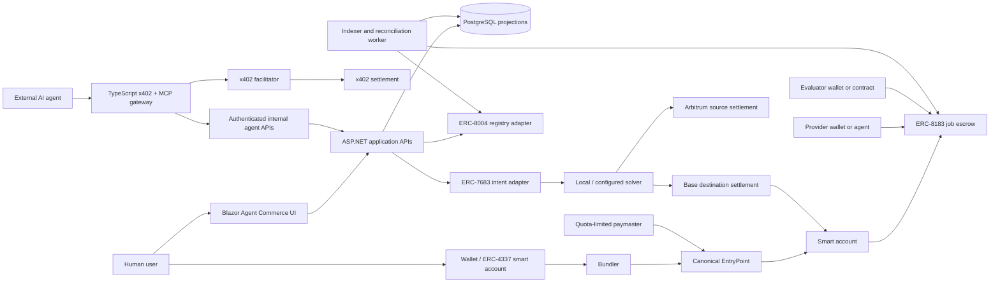

# Agentic Commerce Stack Orchestration Plan

Date: 2026-07-18
Status: implementation-ready design, dependent on the multichain foundation
Standards: x402 v2, ERC-4337, ERC-8004, ERC-8183, ERC-7683

## Outcome

ArtisanalBrew will demonstrate an end-to-end agent-commerce workflow in which:

1. a buyer or AI agent discovers an ArtisanalBrew service and supplier identity;
2. it purchases an immediately delivered quote, brew plan, or provenance report through x402;
3. it evaluates supplier identity and reputation through ERC-8004;
4. it creates and funds an ERC-8183 procurement job whose payment remains in escrow;
5. an ERC-4337 smart account batches and sponsors approved user operations;
6. when the user's funds start on another EVM chain, an ERC-7683-compatible intent asks a solver to deliver the required asset and amount to the execution chain;
7. a provider submits verifiable evidence, an evaluator completes or rejects the job, and the outcome feeds back into reputation.

The initial integration hub is **Base Sepolia**. **Arbitrum Sepolia** is the first source chain for the cross-chain intent demonstration. Local development uses two deterministic EVM nodes before any public testnet transaction is authorized.

This work extends [`multichain-liquid-staking-plan.md`](multichain-liquid-staking-plan.md). It must reuse the chain registry, wallet identity, transaction verification, local EVM workspace, and reconciliation patterns created there. It must not create a second chain registry, wallet session, RPC resolver, or transaction ledger.

## Product Story

The recruiter-facing story is:

> An autonomous buyer discovers a trusted coffee supplier, pays a few cents for a machine-readable quote, routes the required budget from Arbitrum to Base, funds a protected procurement escrow through a sponsored smart account, verifies the submitted coffee-lot evidence, releases payment, and records the result as portable agent reputation.

The customer UI should describe business actions, not protocol names. Protocol details belong in an optional `Protocol Inspector` panel and developer documentation.

## Why Each Standard Exists

| Standard | Responsibility | It must not be used as |
|---|---|---|
| x402 v2 | Immediate HTTP-native payment for a digital response | Escrow for physical fulfillment or dispute resolution |
| ERC-4337 | Smart-account authorization, batching, sponsorship, recovery, and constrained agent permissions | A source of truth for jobs, reputation, or bridging |
| ERC-8004 | Agent identity, advertised endpoints, reputation signals, and validation references | A guarantee that an agent is honest or Sybil-resistant |
| ERC-8183 | Job lifecycle, ERC-20 escrow, provider submission, evaluator decision, payout/refund | A full arbitration system or instant API payment protocol |
| ERC-7683 | Solver-facing representation of a desired cross-chain outcome | A bridge, liquidity source, or automatic safety guarantee |

ERC-8004, ERC-8183, and ERC-7683 are draft standards as of this plan. The application must label them experimental, isolate them behind adapters, pin the exact source revision used, and avoid irreversible schema coupling to draft field names.

## Verified Repository Baseline

The current repository contains:

- ASP.NET Core/Blazor on .NET 10;
- PostgreSQL and Entity Framework Core;
- Nethereum-based wallet and contract services;
- a worker process for order and staking reconciliation;
- `TransparencyRecord`, order, reward, and staking ledger models;
- an in-progress immutable `IChainRegistry` and scoped selected-chain accessor;
- an in-progress Hardhat 3 workspace under `contracts/evm`;
- an in-progress Anchor workspace under `contracts/solana`;
- uncommitted user and multichain changes that must be preserved.

The official x402 v2 reference SDKs support TypeScript, Go, and Python, not .NET. The first implementation should therefore add a small pinned TypeScript gateway rather than hand-writing a protocol implementation inside ASP.NET. ASP.NET remains the owner of catalog, identity, provenance, job projections, and authorization rules.

## Scope

### In scope

- Base Sepolia and deterministic local equivalents for the coherent demo;
- Arbitrum Sepolia/local source chain for an ERC-7683-compatible intent prototype;
- x402-paid MCP/HTTP tools for brew plans, provenance reports, and wholesale quotes;
- local/testnet ERC-8004 registration and reputation integration;
- an ERC-8183-compatible non-upgradeable job escrow;
- an established ERC-4337 EntryPoint/account/bundler/paymaster stack pinned to exact versions;
- constrained agent permissions where supported by an audited account implementation;
- a local solver prototype and resolver/adapter for the current ERC-7683 draft;
- indexing, idempotency, transaction verification, observability, and recruiter-facing UI;
- local deployment and one-command smoke orchestration.

### Out of scope for the first release

- production mainnet deployment or real-value assets;
- custom bridges or solver liquidity networks;
- full legal dispute resolution, shipping insurance, or chargebacks;
- autonomous spending without explicit limits and revocation;
- implementing EntryPoint, a bundler, cryptography, or wallet key custody from scratch;
- making x402 the payment rail for a complete physical-goods order;
- cross-family ERC flows on Solana;
- promising that draft ERC implementations are production standards.

## Target Architecture

### Trust and ownership boundaries

- The browser and external agents are untrusted.
- The x402 gateway may enforce payment but may not directly mutate authoritative commerce state without an authenticated internal request.
- ASP.NET owns business validation and prepares trusted transaction intents/call data.
- Wallets sign; servers never store user or agent private keys.
- Onchain events are the source of truth for escrow state and payment outcomes. PostgreSQL is an indexed projection.
- Agent metadata, endpoint URLs, deliverable URIs, and reputation claims are untrusted input.
- RPC URLs, facilitator URLs, EntryPoint addresses, escrow addresses, registries, paymasters, tokens, and solver contracts come only from server configuration.

## End-to-End Workflow

### 1. Establish controlled authority

The user connects an EVM wallet and creates or selects an ERC-4337 smart account. The first release supports assisted mode: the user confirms funding, cross-chain, and completion operations.

If the selected account implementation has an audited permission/session-key module, the user may grant a revocable policy such as:

- approved agent identity and key;
- allowed chain keys and contract addresses;
- maximum x402 amount per request;
- maximum ERC-8183 job budget and daily aggregate;
- allowed tokens and exact function selectors;
- solver fee, slippage, and deadline limits;
- expiration and immediate revocation.

Do not invent a custom session-key scheme. If no audited compatible module can be integrated locally, retain explicit user confirmation and document the limitation honestly.

### 2. Discover and evaluate agents

ArtisanalBrew and demo suppliers register ERC-8004-compatible metadata containing their HTTPS/MCP endpoints and x402 support. The application indexes only configured registries and verifies endpoint-domain claims when possible.

The UI shows raw signals rather than one misleading universal trust score:

- identity registry and agent ID;
- endpoint-domain verification;
- completed/rejected/expired jobs;
- feedback count by trusted reviewers;
- validation references;
- last successful x402 interaction;
- warnings for missing evidence or suspected Sybil feedback.

### 3. Purchase an immediate resource through x402

The TypeScript gateway publishes these initial resources:

| Resource | Access | Initial price |
|---|---|---:|
| `search_products` | free | none |
| `create_brew_plan` | paid | 0.01 test USDC |
| `get_provenance_report` | paid | 0.02 test USDC |
| `request_wholesale_quote` | paid | 0.02 test USDC |

The paid request flow is:

1. client requests the resource;
2. gateway returns `402 Payment Required` with x402 v2 requirements;
3. client signs the supported payment authorization;
4. client retries with the payment payload;
5. gateway asks the configured facilitator to verify and settle;
6. gateway calls an authenticated internal ASP.NET endpoint;
7. ASP.NET returns deterministic structured output;
8. gateway returns the resource plus a correlation ID and safe payment receipt fields.

Bind fulfillment to HTTP method, normalized route, body hash, payment identity, network, asset, amount, recipient, nonce, and expiry. A payment replay must return the original idempotent result or a conflict; it must never create a second quote or second side effect.

For the initial demo, x402 uses test USDC on Base Sepolia or a local equivalent. CAFE may be demonstrated later through Permit2, but USDC is the baseline because it offers the simplest supported authorization path. Solana Devnet x402 is separate from the requested Solana Testnet staking network and is not required for this EVM integration.

### 4. Create a procurement job

The accepted wholesale quote produces an immutable proposal document containing product/lot requirements, quantity, price, deadline, provider identity, evaluator policy, and evidence schema. Store the document in normal application storage or content-addressed storage and put only its commitment in the job description.

The ERC-8183 contract uses:

- client: user's smart account;
- provider: selected supplier wallet, or zero before assignment;
- evaluator: the user for the first version, then an approved evaluator contract/agent;
- payment token: one configured test USDC contract per escrow deployment;
- budget: exact agreed amount;
- expiry: future timestamp with a UI safety buffer;
- description: proposal commitment and version;
- deliverable: commitment to provider evidence;
- reason: optional completion/rejection evidence commitment.

Start with the minimal non-hooked state machine. Reputation updates occur in the worker after confirmed terminal events. Optional hooks are a later phase because a reverting or malicious hook can block hookable actions until expiry.

### 5. Source the budget across chains when necessary

If the smart account already has enough configured USDC on Base, skip this phase.

Otherwise, the application constructs an ERC-7683-compatible intent expressing:

- permitted input asset and maximum amount on Arbitrum;
- exact destination chain, asset, recipient smart account, and minimum output;
- solver fee/slippage ceiling;
- fill and settlement deadline;
- nonce and replay domain;
- allowlisted settlement/resolver contracts.

The resolver exposes the order in the current canonical solver-facing representation. The solver delivers funds to the smart account, and the application independently verifies destination balance/settlement before enabling ERC-8183 funding.

Do not atomically couple the first intent implementation to the escrow through a complex hook. Treat cross-chain settlement and escrow funding as two explicit, observable stages. A failed or expired intent must leave the job Open and unfunded.

### 6. Fund through ERC-4337

After funds are available, build a UserOperation that batches:

1. exact USDC approval when required;
2. `fund(jobId, expectedBudget)` on the trusted escrow.

The paymaster may sponsor this operation only when server policy, simulation, per-user quota, target contract, selectors, token, value, chain, and expiration all pass. The app must still offer a normal wallet-paid fallback.

### 7. Submit, evaluate, and settle

The provider uploads evidence and submits its commitment. The evaluator verifies the evidence and calls either `complete` or `reject`. Completion releases the configured ERC-20 budget to the provider, minus any explicitly disclosed fee; rejection or expiry refunds the client.

The first evaluator is the user to make the trust model obvious. Automated evaluation may be added only after deterministic validation rules and a manual override/recovery policy exist.

### 8. Update portable reputation

After sufficient confirmations, the worker records an ERC-8004-compatible feedback signal referencing:

- registry and agent ID;
- ERC-8183 job ID and terminal event;
- client/provider/evaluator identities;
- x402 payment proof for the originating quote when applicable;
- proposal, deliverable, and decision commitments;
- tags such as `procurement`, `completed`, `rejected`, `expired`, or `quality`.

Feedback publication is idempotent and must not be able to revert or delay the escrow payout. The UI distinguishes feedback posted by the ArtisanalBrew evaluator from arbitrary feedback.

## Components

### TypeScript agent gateway

Create a focused service, suggested path `src/ThisCafeteria.AgentGateway`, with exact dependency versions and its own lockfile. It owns:

- official x402 v2 server middleware and facilitator client;
- MCP tool definitions and Bazaar discovery metadata;
- request-body schemas and output schemas;
- payment/fulfillment idempotency;
- authenticated calls to internal ASP.NET endpoints;
- structured logs, health/readiness, and OpenTelemetry-compatible correlation IDs.

It does not own catalog data, job state, wallet authentication, or blockchain private keys.

### ASP.NET application

Add bounded services rather than extending `CoffeeWeb3Service`:

- `IAgentDirectoryService`;
- `IAgentResourceService`;
- `IAgenticJobService`;
- `ISmartAccountService`;
- `ICrossChainIntentService`;
- `IOnchainCommerceVerifier`.

All state-changing APIs accept `chainKey`; resolve trusted addresses from `IChainRegistry`. Add chain capabilities and deployment identifiers for x402 settlement visibility, EntryPoint, smart-account factory, paymaster, ERC-8004 registries, ERC-8183 escrow, intent resolver, and settlement contracts without exposing secret RPC/facilitator credentials.

### Contracts

Add contracts under the existing pinned Hardhat workspace:

- ERC-8183-compatible minimal escrow and interfaces;
- optional platform treasury/fee configuration with an explicit maximum;
- test USDC-like token used only for deterministic local testing if the existing test token is unsuitable;
- current ERC-7683 resolver/order fixtures needed by the local prototype;
- deployment scripts and ABI/manifest exports.

Use canonical pinned external deployments/packages for ERC-4337 and ERC-8004 where available. Do not copy or reimplement EntryPoint. If official ERC-8004 registries are not available on the local chain, deploy the pinned reference implementation or a clearly named local test fixture; never label a reduced mock as standards-compliant.

### Persistence projections

Suggested entities:

- `AgentDirectoryEntry` — indexed registry identity and safe metadata cache;
- `AgentResourceFulfillment` — x402 resource, request hash, payment identity, result reference, status;
- `X402PaymentReceipt` — network, asset, amount, payer/payee, settlement transaction, facilitator, timestamps;
- `AgenticJobProjection` — chain, contract, job ID, roles, budget, expiry, commitments, status;
- `AgenticJobEvent` — unique `(ChainKey, TransactionId, LogIndex)` event record;
- `CrossChainIntentProjection` — source/destination, order ID, resolver, solver, amounts, deadlines, status;
- `AgentFeedbackProjection` — registry, agent ID, reviewer, feedback index, tags, evidence and revocation state;
- `SmartAccountProfile` — owner user, chain, account address, implementation/factory versions; never keys.

Store large quote/deliverable documents outside contract storage. Persist hashes, safe display metadata, and storage references. Validate maximum lengths and never fetch arbitrary URIs from the server without SSRF controls.

### Worker

Extend the worker with independent supervised loops for:

- ERC-8183 events;
- configured ERC-8004 registry events;
- intent order/fill/settlement events;
- x402 settlement confirmation when needed;
- pending reputation publication;
- reorg/finality reconciliation.

Use bounded block ranges, independent checkpoints, exponential backoff, cancellation, health signals, and idempotent unique keys. One failing provider or protocol must not stop the other loops.

## UI

Add an authenticated `Agent Commerce` or `Procurement Lab` area with:

- agent directory and trust-signal details;
- free/paid resource playground showing the 402 challenge and settlement receipt;
- procurement job creation form;
- job state stepper: Open, Funded, Submitted, Completed/Rejected/Expired;
- provider evidence submission view;
- evaluator decision view;
- intent route preview and explicit cross-chain confirmation;
- smart-account/paymaster status and permission revocation;
- transaction explorer links from the shared chain registry;
- optional `Protocol Inspector` with correlation IDs, standards used, contract addresses, transaction hashes, and decoded events.

Never present a draft standard, reputation score, solver quote, or evaluator decision as a guarantee. Never hide fees, source/destination amounts, deadlines, or the identity that can release escrow.

## Local Orchestration

Create a separate Compose profile/file so the normal application remains lightweight. The deterministic agentic stack should include:

- PostgreSQL;
- ASP.NET web;
- worker;
- TypeScript agent gateway;
- local Base-like EVM node;
- local Arbitrum-like EVM node;
- pinned ERC-4337 bundler and paymaster service or an established local dev stack;
- local x402 facilitator/reference setup where supported;
- local intent solver;
- deployed tokens, EntryPoint/account infrastructure, ERC-8004 registries, ERC-8183 escrow, and intent fixtures.

Provide idempotent scripts for:

- dependency install;
- starting both nodes;
- deploying all contracts in dependency order;
- seeding user, buyer agent, provider agent, evaluator, test USDC, catalog, and provenance evidence;
- starting services;
- running the complete smoke demo;
- stopping without deleting the developer's persistent database unless explicitly requested.

Generated manifests must include chain key/ID, contract addresses, deployment block, compiler and optimizer settings, exact package/source revisions, ABI checksums, and timestamp. Secrets and private RPC URLs never enter tracked manifests.

## Implementation Phases and Gates

### Current implementation status — audited 2026-07-20

The repository now contains a structurally verified foundation for agentic commerce.

**Test-Verified and Implemented:**
- **x402 Gateway:** Clean TypeScript build, successful integration tests proving idempotency binding to request/payment metadata, and replay-protection against double-charging (Priority 2 & 3).
- **Escrow Reconciliation:** Event syncing is implemented via `AgenticCommerceReconciliationWorker`. Integration tests prove idempotent state transitions and concurrency checks. EF Core configuration enforces correct on-chain identities (`ChainKey` + `ContractAddress` + `OnChainJobId`).
- **Smart Account Scaffolding:** `SmartAccountService` safely fails closed (throwing `NotSupportedException`) for operations like deployment, sponsorship, recording usage, and revoking sessions. This prevents spoofed implementations until real external dependencies exist.
- **Verification Command:** `dotnet test tests/ThisCafeteria.UnitTests` (136 passing), `npm test` in gateway (8 passing), `npm test` in EVM contracts (24 passing).

**Fixture-Only or Blocked:**
- **Smart Account Infrastructure:** True ERC-4337 dependencies (paymaster, bundler, session keys) remain stubbed and unconfigured.

### Known Limitations: Reorg Recovery

The current agentic commerce worker relies strictly on confirmation depth (e.g., a configured `MinimumConfirmations` delay) to prevent indexing ephemeral state. However, if a deep chain reorganization occurs that rolls back a previously confirmed event (such as `JobFunded` or `JobCompleted`), the system **does not automatically revert** the database projections.

**Future Implementation:**
A complete reorg-recovery architecture will require:
1. Continuous `BlockHeader` tracking and ancestor hash verification within the indexer loop.
2. Detecting divergences and querying the database for all applied events post-divergence.
3. Inverse applicators that deterministically reverse state transitions (e.g., changing `Status` from `Completed` back to `Open`, adjusting concurrency tokens, and clearing transaction hashes).
4. Re-fetching events from the new canonical chain and rolling them forward.

Until this is implemented, full reorg rollback remains unsupported. Manual database intervention is required if a deep reorg outpaces the configured confirmation delay.

### Phase 0 — Protect and characterize the baseline

- inspect `git status` and preserve unrelated/in-progress multichain changes;
- read this plan and the multichain plan completely;
- run existing .NET and contract tests;
- map current configuration, wallet, transaction verification, worker, and database conventions;
- record which multichain pieces are complete rather than duplicating them.

Gate: baseline results and ownership boundaries are documented before edits.

### Phase 1 — Contracts and local protocol fixtures

- pin current official specifications and package/source revisions;
- implement and thoroughly test the minimal ERC-8183 escrow;
- install/deploy canonical ERC-4337 local infrastructure;
- deploy pinned ERC-8004 reference registries or honest local fixtures;
- implement the ERC-7683 resolver/order and local solver prototype;
- export ABIs and manifests.

Gate: contract tests and direct local scripts complete create/fund/submit/complete, reject, expiry refund, sponsored UserOperation, identity registration/feedback, and source-to-destination intent fulfillment.

### Phase 2 — x402 and MCP vertical slice

- add the TypeScript gateway;
- implement one free and three paid resources;
- add internal ASP.NET resource endpoints;
- implement payment binding, idempotency, and receipts;
- publish MCP tools and Bazaar-compatible metadata;
- add gateway integration tests with a local/test facilitator.

Gate: an unauthenticated paid request returns 402, a valid payment returns the deterministic resource once, and replay/tampering/settlement failure tests pass.

### Phase 3 — Identity directory and job application path [COMPLETED]

- index ERC-8004 identities and signals;
- add ERC-8183 projections and APIs;
- implement job creation, provider assignment, budget, funding preparation/verification, submission, evaluator decision, and expiry refund;
- create Procurement Lab UI and protocol inspector.

Gate: a normal wallet completes the local procurement lifecycle before smart-account abstraction is required.

### Phase 4 — ERC-4337 user experience

- integrate smart-account creation/discovery through a pinned established stack;
- add bundler and paymaster clients;
- batch approval plus funding;
- enforce sponsorship quotas and simulation;
- add explicit fallback and permission revocation;
- add constrained session permissions only with an audited compatible module.

Gate: sponsored and user-paid flows both work; over-budget, wrong-target, wrong-selector, expired, and revoked operations fail.

### Phase 5 — ERC-7683 cross-chain path

- produce source/destination quote preview;
- create/sign/submit intent orders;
- run local solver and verify destination settlement;
- enable escrow funding only after verified destination funds;
- add expiry, partial/failing fill, slippage, duplicate, and solver-misbehavior tests.

Gate: the two-node smoke test moves the configured test asset from the Arbitrum-like node to the Base-like smart account, then funds the job. Failure leaves the job Open and recoverable.

### Phase 6 — Hardening and public testnet readiness

- full end-to-end browser and MCP-agent tests;
- threat model and abuse limits;
- reconciliation/reorg tests;
- accessibility and responsive review;
- secrets/configuration documentation;
- Base Sepolia/Arbitrum Sepolia dry-run manifests without broadcasting;
- explicit user approval before any public deployment or funded testnet transaction.

Gate: local demo, test suite, security checklist, and rollback/recovery documentation pass.

## Security Requirements

### x402

- use official maintained middleware and exact dependency versions;
- bind payments to route, method, body hash, asset, amount, recipient, chain, nonce, and expiry;
- enforce idempotent fulfillment and payment replay protection;
- treat facilitator response and settlement transaction as independently verifiable inputs;
- rate-limit free challenge generation and paid resource execution;
- never return secrets or internal service credentials in MCP/Bazaar metadata.

### ERC-4337

- use canonical EntryPoint and established bundler/account implementations;
- simulate every UserOperation and validate chain, sender, nonce, target, selector, token, value, gas, deadline, and paymaster policy;
- quota sponsorship per identity/account/IP and prevent arbitrary-call sponsorship;
- never ask users to sign raw EIP-7702 delegations in application UI;
- make permissions visible, expiring, least-privilege, and revocable.

### ERC-8004

- display issuer/reviewer identity and raw signals;
- do not aggregate arbitrary feedback as trusted reputation;
- protect URI retrieval against SSRF, oversized responses, redirects, invalid content types, and private network targets;
- hash/canonicalize cached metadata and support revocation/update events;
- label Sybil and draft-standard limitations.

### ERC-8183

- safe ERC-20 transfers, reentrancy protection, checks-effects-interactions, role/state validation, exact-budget front-running protection, and safe fee ceiling;
- evaluator, token, expiry, provider, proposal commitment, and fees visible before funding;
- refunds remain available after expiry and cannot be blocked by optional policy hooks;
- no upgradeable admin may seize escrow or alter job participants/budget after funding;
- do not claim arbitration beyond complete/reject/expiry semantics.

### ERC-7683

- allowlist source/destination chains, assets, resolvers, settlement contracts, and solver entry points;
- enforce minimum output, maximum input, slippage, fee, nonce, replay domain, and deadlines;
- independently verify destination settlement before allowing escrow funding;
- a failed intent cannot create a funded job or silently fall back to another chain/asset;
- clearly label the local solver as a prototype, not a production bridge.

## Testing Matrix

### Contract tests

- every ERC-8183 state transition and forbidden transition;
- client/provider/evaluator authorization;
- set-budget front-running guard;
- provider assignment and optional bidding path;
- completion payout, fee, rejection refund, expiry refund;
- reentrancy, false-return token, fee-on-transfer token, zero values, deadline boundaries;
- invariant: terminal job cannot transition again and escrow is conserved;
- EntryPoint/account/paymaster integration and rejection policy;
- ERC-8004 identity/feedback/revocation integration;
- intent resolve/fill/settlement and replay/deadline/slippage failures.

### Service tests

- x402 402 challenge, valid settlement, bad signature, wrong chain/token/amount/recipient, body tampering, replay, timeout, and idempotent result;
- internal gateway authentication and authorization;
- untrusted metadata/URI SSRF and size controls;
- event decoding, idempotency, confirmations, reorg rollback, and wrong-contract rejection;
- paymaster quotas and arbitrary-call denial;
- cross-chain balance and settlement verification;
- migrations and unique indexes.

### End-to-end smoke test

1. seed buyer, provider, evaluator, product, and test balances;
2. discover provider via indexed ERC-8004 metadata;
3. call a paid wholesale quote tool and observe 402;
4. settle x402 payment and receive one quote;
5. create the ERC-8183 job from the proposal commitment;
6. source funds from the local Arbitrum-like chain through an intent;
7. batch approval and funding through a sponsored UserOperation;
8. provider submits evidence;
9. evaluator completes the job;
10. provider receives escrow;
11. worker posts/indexes reputation feedback;
12. UI and protocol inspector show matching correlated records and explorer links.

Run rejection and expiry/refund variants as separate automated tests.

## Observability

Carry one correlation ID across:

- MCP/x402 request and payment receipt;
- proposal commitment;
- intent order/fill;
- UserOperation hash and transaction hash;
- ERC-8183 job ID and event logs;
- ERC-8004 feedback record.

Emit structured metrics for payment challenges/settlements, quote fulfillment, bundler/paymaster rejection reasons, job state duration, intent fill latency/failure, indexer lag, RPC health, and feedback publication. Do not log signatures, private keys, authorization payloads, service credentials, or full sensitive deliverables.

## Rollout Strategy

1. local-only flags for every protocol;
2. Base Sepolia x402/resource demo;
3. Base Sepolia identities and escrow with manually funded normal wallets;
4. Base Sepolia smart account and paymaster;
5. Arbitrum Sepolia to Base Sepolia intent prototype;
6. optional constrained agent permissions;
7. no mainnet recommendation until standards stabilize and an external contract/security review is complete.

Each capability has an independent kill switch. Disabling x402 must not stop direct application access for authorized test users; disabling intents must leave same-chain escrow available; disabling sponsorship must fall back to user-paid gas; disabling reputation publication must not affect settlement.

## Definition of Done

- the complete local end-to-end smoke story passes reproducibly;
- Base and Arbitrum responsibilities come from the shared chain registry;
- x402 uses official middleware and returns paid resources idempotently;
- agent identities and trust signals are visible with honest limitations;
- ERC-8183 escrow transitions, funds, refunds, and events pass security-focused tests;
- ERC-4337 sponsorship and batching work with a safe fallback;
- the ERC-7683 prototype proves two-chain outcome fulfillment without pretending to be a production bridge;
- no private keys, unrestricted agent authority, or secret RPC/facilitator credentials are committed;
- existing checkout, reward, staking, chain selector, and wallet authentication tests still pass;
- all generated ABIs/manifests are reproducible and versioned;
- documentation includes architecture, local runbook, demo script, threat model, limitations, and recovery procedures;
- no public deployment is broadcast without explicit user approval.

## Primary References

- x402 overview: <https://docs.cdp.coinbase.com/x402/welcome>
- x402 network support: <https://docs.cdp.coinbase.com/x402/network-support>
- x402 Bazaar: <https://docs.cdp.coinbase.com/x402/bazaar>
- x402 MCP server: <https://docs.cdp.coinbase.com/x402/mcp-server>
- ERC-4337: <https://eips.ethereum.org/EIPS/eip-4337>
- EIP-5792 wallet call API: <https://eips.ethereum.org/EIPS/eip-5792>
- EIP-7702 safety context: <https://eips.ethereum.org/EIPS/eip-7702>
- ERC-8004: <https://eips.ethereum.org/EIPS/eip-8004>
- ERC-8183: <https://eips.ethereum.org/EIPS/eip-8183>
- ERC-7683: <https://eips.ethereum.org/EIPS/eip-7683>
