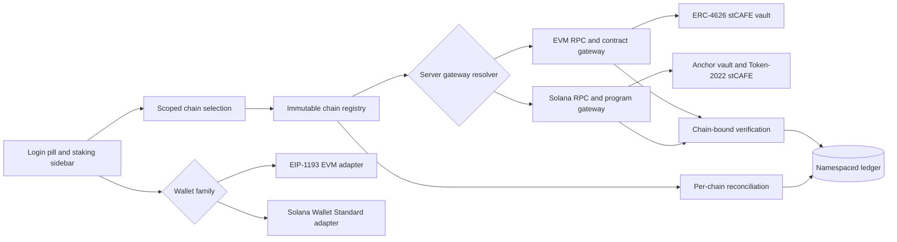

# Multichain Liquid Staking Orchestration Plan

Date: 2026-07-18
Status: implementation-ready design
Scope: wallet login, chain selection, liquid staking, transaction verification, reconciliation, and reproducible local contract deployment

## Outcome

ArtisanalBrew will retain Ethereum Sepolia and add Hedera Testnet, Avalanche Fuji, Linea Sepolia, Base Sepolia, BNB Smart Chain Testnet, Monad Testnet, Arbitrum Sepolia, and Solana Testnet.

The product behavior remains:

- deposit CAFE;
- receive a transferable liquid receipt token named stCAFE;
- continue earning COFFEE rewards while holding stCAFE;
- redeem stCAFE for CAFE;
- select the active chain from both the login pill and the staking dashboard sidebar.

This is liquid staking of the application's CAFE asset, not native validator staking of ETH, AVAX, HBAR, BNB, MON, or SOL.

## Verified Baseline

### Deployed Ethereum Sepolia contracts

The supplied short links resolve to:

| Role | Address | Current explorer status |
|---|---|---|
| CAFE payment token | [`0x15DbED39271D2788a9Be63ffB34C8E2DdED8754A`](https://sepolia.etherscan.io/address/0x15DbED39271D2788a9Be63ffB34C8E2DdED8754A) | Contract source unverified |
| COFFEE reward token | [`0x4056E7F5FD1584C3db6223c9483761Dcb30Bf21C`](https://sepolia.etherscan.io/address/0x4056E7F5FD1584C3db6223c9483761Dcb30Bf21C) | Contract source unverified |
| Legacy staking pool | [`0x932d50E20F917B9BbBe2C40F30D43BCef0e93F90`](https://sepolia.etherscan.io/address/0x932d50E20F917B9BbBe2C40F30D43BCef0e93F90) | Contract source unverified |

The app configuration already points to these addresses. They are suitable as a behavioral and migration baseline, but the unverified bytecode means the implementation must not assume that the repository source is an exact reproducible build of the deployments.

### Current staking path

1. [`YieldPanel.razor`](../src/ThisCafeteria.Web/Components/Shared/YieldPanel.razor) resolves one global `BlockchainNetworkOptions` instance.
2. [`coffeeStaking.js`](../src/ThisCafeteria.Web/wwwroot/js/coffeeStaking.js) discovers MetaMask, switches to the one configured EVM network, requests an exact ERC-20 approval, and calls `stake`, `unstake`, or a detected reward-claim function.
3. [`StakingController.cs`](../src/ThisCafeteria.Web/Controllers/StakingController.cs) checks the wallet session, asks the chain service to verify the transaction, and writes a ledger row.
4. [`CoffeeWeb3Service.cs`](../src/ThisCafeteria.Web/Services/Blockchain/CoffeeWeb3Service.cs) owns RPC access, balances, minting, payment verification, staking reads, claim probing, and staking verification for a single chain.
5. [`StakingLedgerReconciliationWorker.cs`](../src/ThisCafeteria.Worker/StakingLedgerReconciliationWorker.cs) scans ERC-20 transfer logs for one pool and one RPC.

### Single-chain and EVM assumptions that must be removed

- Configuration is one `Blockchain:Network` object registered as a singleton.
- Wallet authentication only accepts 20-byte EVM addresses and `personal_sign` recovery.
- `ApplicationUser.WalletAddress` and ledger wallet columns are limited to 42 characters.
- `WalletAddress` is globally unique without a chain-family namespace.
- `WalletChainId` is an `int`; Solana clusters have no EVM chain ID.
- Session state stores only `WalletAddress`, not family and selected chain.
- Transaction IDs are assumed to be 66-character EVM hashes.
- The ledger has a globally unique transaction-hash index; a multichain key and event/instruction index are required.
- Contract and token identifiers are constrained to 42 characters; Solana public keys are base58 strings.
- The login pill hard-codes the Ethereum logo and `ETH Sepolia`.
- The staking page hard-codes MetaMask, ETH gas text, CAFE staking calls, and EVM explorer URL construction.
- Dashboard state is keyed only by address.
- The worker has one numeric block cursor and one staking-pool address.
- Checkout, reward minting, and staking share the same single-chain service. Refactoring staking must preserve Sepolia checkout behavior.
- No Hardhat, Foundry, Anchor, or reproducible deployment project exists.
- [`contracts/ThisCafeteriaTokens.sol`](../contracts/ThisCafeteriaTokens.sol) is an empty tracked file.

## Supported Network Registry

Public RPC values below come from the requested [thirdweb testnet chain list](https://thirdweb.com/chainlist/testnets) and [Solana RPC Node List](https://www.rpcnodelist.com/solana-testnet). Public values are defaults only. Production server RPC URLs must be independently overridable and must never be returned to the browser when they contain credentials.

| Chain key | Family | Chain/cluster | Hex ID | Native asset | Public RPC default | Explorer |
|---|---|---:|---:|---|---|---|
| `ethereum-sepolia` | EVM | 11155111 | `0xaa36a7` | ETH | `https://ethereum-sepolia-rpc.publicnode.com` | `https://sepolia.etherscan.io` |
| `hedera-testnet` | EVM relay | 296 | `0x128` | HBAR | `https://296.rpc.thirdweb.com` | `https://hashscan.io/testnet` |
| `avalanche-fuji` | EVM | 43113 | `0xa869` | AVAX | `https://43113.rpc.thirdweb.com` | `https://testnet.snowtrace.io` |
| `linea-sepolia` | EVM | 59141 | `0xe705` | ETH | `https://59141.rpc.thirdweb.com` | `https://sepolia.lineascan.build` |
| `base-sepolia` | EVM | 84532 | `0x14a34` | ETH | `https://84532.rpc.thirdweb.com` | `https://sepolia.basescan.org` |
| `bsc-testnet` | EVM | 97 | `0x61` | tBNB | `https://97.rpc.thirdweb.com` | `https://testnet.bscscan.com` |
| `monad-testnet` | EVM | 10143 | `0x279f` | MON | `https://10143.rpc.thirdweb.com` | `https://monad-testnet.socialscan.io` |
| `arbitrum-sepolia` | EVM | 421614 | `0x66eee` | ETH | `https://421614.rpc.thirdweb.com` | `https://sepolia.arbiscan.io` |
| `solana-testnet` | Solana | `testnet` | n/a | SOL | `https://api.testnet.solana.com` | `https://explorer.solana.com/?cluster=testnet` |

Solana's second public fallback is `https://solana-testnet.drpc.org`. Solana's own documentation warns that Testnet is primarily for validator and release stress testing and can be intermittently unavailable. The requested Testnet entry will be implemented, while localnet remains the deterministic development and CI target.

Each registry entry also needs:

- display name, short name, icon asset, family, enabled flag, sort order;
- native currency name/symbol/decimals;
- public wallet RPC and private server RPC;
- explorer address/transaction URL templates;
- minimum confirmations or Solana commitment policy;
- CAFE, COFFEE, stCAFE, liquid-vault, faucet, and marketplace identifiers;
- deployment start block/slot;
- capability flags: wallet login, liquid staking, legacy exit, faucet, marketplace payment, and reward minting.

## Target Architecture

### Chain configuration and selection

Replace the singleton `BlockchainNetworkOptions` with:

- `BlockchainOptions`: default chain key plus a dictionary/list of chain definitions;
- immutable `IChainRegistry`: validates uniqueness, family-specific fields, identifiers, and capability consistency at startup;
- scoped `ISelectedChainAccessor`: resolves the selected key from an explicit request value and a protected same-site cookie/session value;
- a reusable `ChainSelector.razor` used in both the login pill/menu and `yield-sidebar`;
- `GET /api/chains` for sanitized public metadata;
- antiforgery-protected `POST /api/chains/select` for persistence.

Every state-changing blockchain request must include `chainKey`. The server must resolve trusted RPC and contract identifiers from its own registry and reject a request whose selected family, wallet, transaction, or configured deployment does not agree. Never accept RPC URLs or contract addresses from the client.

### Wallet identity and authentication

Introduce `WalletIdentity` instead of treating an address as a property of one chain:

- `UserId`;
- `Family` (`Evm` or `Solana`);
- normalized address/public key and display form;
- wallet provider name;
- verified timestamp.

Use a unique index on `(Family, NormalizedAddress)`. The same EVM key represents the same identity across EVM networks; the active chain is request/session context, not identity. A Solana public key is a separate identity unless an explicit account-linking flow proves control of both wallets.

Authentication becomes family-specific behind `IWalletSignatureVerifier`:

- EVM: retain nonce expiry and signer recovery, but bind the challenge to domain, URI, family, selected chain key/ID, nonce, issue time, and expiration;
- Solana: use `signMessage` through Solana Wallet Standard and verify the Ed25519 signature server-side against the base58 public key;
- challenges are single-use, rate-limited, session-bound, and cannot be verified under another family or chain key.

Migrate existing `ApplicationUser.WalletAddress`, `WalletChainId`, and claims into `WalletIdentity` without losing existing users. Keep a compatibility read during one release, then remove the old columns in a later migration.

### Server blockchain services

Decompose `CoffeeWeb3Service` into bounded services:

- `IBlockchainGatewayResolver` keyed by chain family;
- `ILiquidStakingGateway` for dashboard reads and transaction verification;
- `IMarketplacePaymentGateway` so current checkout keeps working independently;
- `IRewardTokenGateway` for COFFEE operations;
- `IEvmClientFactory` caches RPC clients per immutable chain definition;
- `ISolanaClientFactory` does the same for Solana RPC clients.

Dashboard and notification state must be keyed by `(chainKey, family, normalized wallet)`. A response should carry the chain key so stale asynchronous reads from a previously selected network cannot overwrite the current dashboard.

## Liquid Staking Protocol

### EVM vault

Deploy a new `CafeLiquidStakingVault` rather than modifying the legacy pool.

The vault should:

- implement ERC-4626 over CAFE;
- make the vault share token the transferable stCAFE ERC-20;
- use OpenZeppelin's current ERC-4626 inflation/donation protections;
- expose standard `deposit`, `mint`, `withdraw`, `redeem`, preview, conversion, and limit methods;
- distribute separately funded COFFEE with a bounded reward schedule;
- checkpoint global and per-account COFFEE reward accounting before mint, burn, and every stCAFE transfer so accrued rewards cannot be duplicated and future rewards follow the transferred liquid position;
- expose `earned`, `claimRewards`, reward rate, period finish, and funding events;
- use safe transfers, reentrancy protection, two-step ownership or roles, and deposit pause controls;
- allow withdrawals and reward claims while new deposits are paused;
- prohibit owner rescue of user CAFE principal or committed COFFEE rewards;
- reject zero amounts, invalid durations, and reward schedules exceeding funded balance.

CAFE remains principal; COFFEE remains the reward asset. stCAFE is the transferable position. This preserves the supplied contract semantics while making the position liquid.

For Ethereum Sepolia, deploy the new vault against the existing CAFE and COFFEE addresses. Do not redeploy or replace those tokens as part of migration. For the other EVM testnets, deploy explicit testnet CAFE and COFFEE contracts from reproducible source, then deploy the vault and faucet.

### Legacy Sepolia migration

Because the existing contracts are not verified and the pool is not an upgradeable proxy under repository control:

- disable new deposits into the legacy pool in the app;
- retain legacy balance, pending reward, claim, and unstake/withdraw support;
- show a guided `Exit legacy pool` then `Deposit into stCAFE vault` flow;
- verify and record both transactions independently;
- do not claim atomic migration unless wallet batching is actually supported and both receipts are verified;
- keep the legacy reconciler enabled until the configured pool is drained or explicitly retired.

### Solana program

Solana is a separate protocol implementation, not a translation of EVM chain IDs or Solidity ABIs.

Use an Anchor workspace with:

- SPL CAFE and COFFEE mints for localnet/testnet;
- a vault authority PDA and CAFE custody token account;
- Token-2022 stCAFE receipt mint;
- deposit, redeem, reward funding, reward checkpoint, and reward claim instructions;
- checked token transfers and explicit mint-decimal validation;
- PDA seed/version constants and account constraints;
- pause/admin controls that cannot seize principal;
- emitted events suitable for reconciliation;
- a Token-2022 transfer hook, or another audited mechanism with equivalent guarantees, to checkpoint COFFEE entitlement whenever transferable stCAFE moves. A plain SPL transfer plus address-local reward debt is not acceptable because it permits lost or duplicated rewards.

Do not expose Solana staking as enabled until deposit, transfer, reward accrual, claim, redeem, signature verification, server-side instruction verification, and reconciliation all pass parity tests.

## UI and Transaction Flows

### Shared selector

The same component and state source must drive both placements:

- login pill: network icon, short network name, and wallet address when connected; selecting a chain is possible before login;
- staking sidebar: full network selector near Account Overview and visible at desktop widths;
- mobile: the selector appears in the existing account/navigation drawer and staking sidebar equivalent;
- keyboard operation, focus management, `aria-expanded`, `aria-activedescendant` or native listbox semantics, and readable chain names are required.

Selecting an EVM network should request `wallet_switchEthereumChain`, falling back to `wallet_addEthereumChain` from registry metadata. Selecting Solana changes wallet family/cluster and uses a Solana wallet connection. Crossing from EVM to Solana must never reuse the prior address as if it were valid.

### Liquid staking dashboard

Replace stake/unstake language and data with:

- CAFE available;
- stCAFE wallet balance;
- CAFE value redeemable for stCAFE;
- stCAFE exchange rate;
- pending COFFEE;
- deposit CAFE and expected stCAFE preview;
- redeem stCAFE and expected CAFE preview;
- claim COFFEE;
- chain-specific gas/faucet help;
- legacy Sepolia exit/migration card when applicable.

EVM deposit steps: approve if allowance is insufficient, deposit, confirmations, server verification/record.
EVM redeem steps: redeem, confirmations, server verification/record.
Solana steps: build the expected instruction, wallet sign/send, wait for configured commitment, server verify program/instruction/accounts/amounts, record.

Listen for EVM `accountsChanged` and `chainChanged`, and Solana wallet account/disconnect events. Cancel stale dashboard requests, clear incompatible transaction state, and require the active account to match the authenticated identity.

## Persistence and Reconciliation

Evolve ledger records to include:

- `ChainKey` and `Family`;
- wallet identifier up to 64 characters;
- transaction/signature identifier up to 128 characters;
- event/instruction index;
- action (`deposit`, `redeem`, `claim`, `legacy-unstake`, `legacy-claim`);
- asset amount, share amount, and reward amount as separate precision-safe values;
- asset, receipt, reward, and vault/program identifiers up to 64 characters;
- block number or slot, timestamp, explorer URL, and verification status.

Use a unique key such as `(ChainKey, TransactionId, OperationIndex)` rather than a global unique transaction hash. Checkpoints must be unique by `(ChainKey, SourceIdentifier)` and support either EVM block cursors or Solana slot/signature cursors.

The worker should create one supervised reconciliation loop per enabled deployment, with bounded ranges, per-chain backoff, cancellation, health metrics, and independent checkpoints. One failing RPC must not stop other chains.

## Reproducible Local Deployment

### EVM

Create `contracts/evm` as a pinned Hardhat 3 TypeScript project. Hardhat is preferred here because Node is already available in the workspace and Hedera documents the same workflow through its JSON-RPC relay.

Required deliverables:

- production contracts, test-only token fixtures, and the faucet;
- unit, fuzz/property, and invariant tests;
- a local Hardhat node target using chain ID 31337;
- idempotent deploy and seed scripts;
- deployment scripts parameterized by chain key and environment variables;
- ABI export consumed by the web project instead of duplicated handwritten fragments;
- deployment manifests containing chain key/ID, addresses, deploy block, compiler/settings, source commit, ABI checksum, and timestamp;
- no private keys in repository files, logs, manifests, or client configuration.

### Solana

Create `contracts/solana` as a pinned Rust/Anchor workspace with local validator tests. Produce the IDL, program ID, mint addresses, deployment slot, and checksums in a Solana deployment manifest.

### App integration

Development startup should be able to load generated local deployment manifests into configuration without editing committed `appsettings.json`. Add scripts and documentation for:

1. start PostgreSQL;
2. start the local EVM node and Solana validator;
3. build/deploy/seed both protocol families;
4. apply EF migrations;
5. start the web and worker projects;
6. run an end-to-end deposit, transfer, reward, claim, and redeem smoke test.

Public testnet deployment scripts may be prepared, but they must not broadcast transactions without explicit authorization.

## Orchestration Sequence

### Phase 0 — Baseline and contract recovery

- Preserve the dirty worktree and inventory current changes.
- Record the three legacy Sepolia deployments and start blocks.
- Treat the empty token source and unverified explorer contracts as explicit gaps.
- Add characterization tests for current Sepolia login, checkout, staking verification, and ledger behavior.

Gate: current .NET tests pass and current Sepolia behavior has regression coverage.

### Phase 1 — Local protocol workspaces

- Build and test the EVM ERC-4626/reward vault.
- Build and test the Solana program and Token-2022 reward-transfer accounting.
- Generate ABIs/IDLs and local deployment manifests.
- Demonstrate local deposit, stCAFE transfer, COFFEE accrual/claim, and CAFE redemption.

Gate: contract tests and local protocol smoke tests pass without the web app.

### Phase 2 — Registry, identity, and schema

- Add the immutable multichain registry and validation.
- Add wallet-family identity and safe data migrations.
- Expand ledger identifiers and namespaced uniqueness.
- Add selected-chain state and sanitized chain metadata endpoints.

Gate: migration forward/backward tests, registry validation tests, and authentication unit tests pass.

### Phase 3 — EVM application path

- Decompose the single-chain service and introduce per-chain EVM clients.
- Implement EVM liquid-vault reads, deposit/redeem/claim verification, and reconciliation.
- Preserve checkout on Ethereum Sepolia through its own gateway.
- Add the shared selector to the login pill and staking sidebar.
- Add the new dashboard and the legacy Sepolia migration panel.

Gate: local EVM end-to-end test and existing checkout tests pass.

### Phase 4 — EVM testnet rollout readiness

- Add all seven new EVM registry entries and capability gates.
- Prepare deploy/verify/fund scripts and faucet documentation.
- Refuse to enable staking where a manifest or required contract is absent.

Gate: dry-run manifests validate for every chain; no public broadcast occurs automatically.

### Phase 5 — Solana application path

- Add Solana Wallet Standard login and transaction module.
- Add server Ed25519 verification, RPC adapter, instruction verification, and reconciliation.
- Render the same liquid-staking semantics with Solana-specific transaction status.

Gate: localnet end-to-end parity, then Solana Testnet smoke tests when separately authorized.

### Phase 6 — Hardening and rollout

- Add RPC timeouts, retry/backoff, circuit health, structured logs, and chain labels.
- Add reorg/finality tests, duplicate-event tests, stale-selection tests, and selector accessibility tests.
- Run database, web, worker, EVM, Solana, and browser test suites.
- Roll out behind per-chain capability flags, Ethereum Sepolia first, then one EVM testnet at a time, then Solana.

Gate: observability and rollback procedures are documented, and every enabled chain has a verified deployment manifest.

## Critical Risks and Controls

| Risk | Control |
|---|---|
| Wrong-chain transaction accepted | Require `chainKey`, trusted server registry lookup, actual chain receipt/instruction verification, and namespaced ledger key |
| Private RPC credential leaks | Separate public wallet RPC from server RPC and sanitize `/api/chains` |
| EVM address reused as Solana identity | Family-qualified identity and verifier dispatch |
| stCAFE transfer duplicates COFFEE rewards | Checkpoint rewards on every EVM share update; require Token-2022 hook/equivalent on Solana |
| Existing Sepolia users stranded | Keep legacy exit/claim and guided migration until retirement |
| Unverified legacy bytecode assumed safe/upgradable | Deploy a new vault; do not proxy-upgrade legacy addresses |
| One bad testnet stops the worker | Independent per-chain loops, checkpoints, backoff, and health reporting |
| RPC list changes or rate limits | Configuration overrides, health checks, and no hard dependency on one public endpoint |
| Solana Testnet instability | Localnet for CI and deterministic development; explicit degraded state in UI |
| Scope breaks checkout | Split payment gateway from staking gateway and retain Sepolia characterization tests |

## Definition of Done

- Nine public network entries are available and correctly rendered.
- The same selected chain is shown in the login pill and staking sidebar, survives navigation/reload, and cannot cross-contaminate dashboard state.
- EVM and Solana wallet ownership are verified with family-appropriate signatures.
- Local EVM and Solana deployments are reproducible from a clean checkout.
- Depositing CAFE mints transferable stCAFE; transferring stCAFE preserves correct COFFEE reward accounting; claiming COFFEE and redeeming CAFE are verified and reconciled.
- Existing Ethereum Sepolia checkout still works.
- Existing Sepolia pool users can claim/exit and migrate.
- Database uniqueness and identifiers are chain-safe.
- Public testnet actions are capability-gated and never broadcast by an unattended build.
- .NET, contract, migration, integration, and browser tests pass, with deployment and rollback documentation complete.
